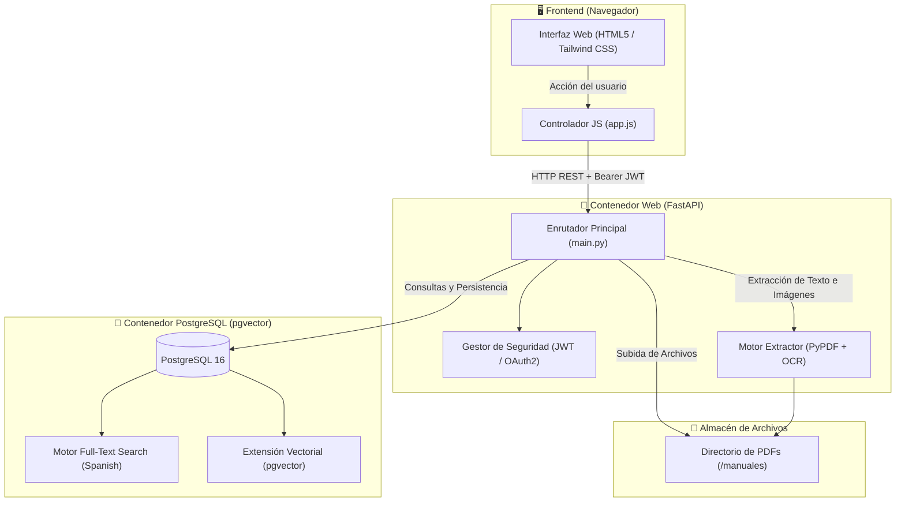
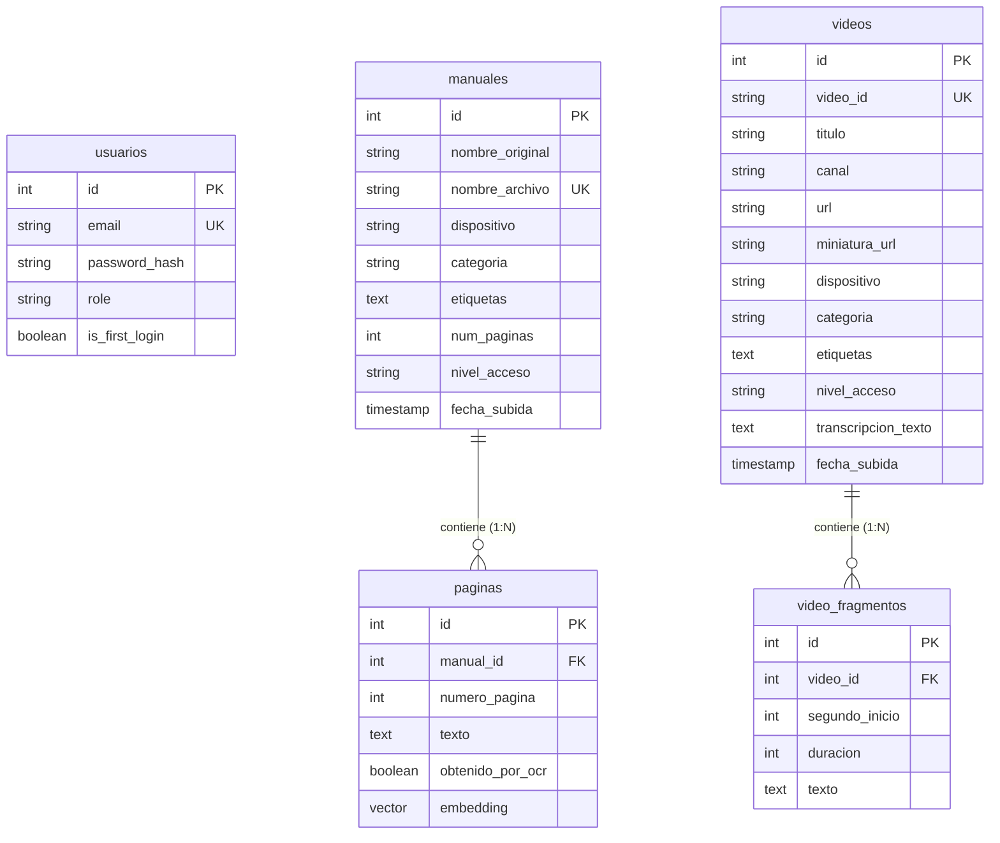

# 📚 Documentación Técnica Integral: Buscador de Manuales IoT & Videos

> **Versión del Sistema:** 2.3 (Visor PDF In-App con Deep Linking + Packs de Obra ZIP + Sincronización Automática)  
> **Fecha de Actualización:** 2026-09-07  
> **Arquitectura:** Cliente-Servidor Desacoplado (FastAPI + PostgreSQL pgvector + Vanilla JS)  
> **Entorno:** Dockerizado con orquestación mediante Docker Compose  

---

## 📑 Tabla de Contenidos
1. [Resumen Ejecutivo y Propósito](#1-resumen-ejecutivo-y-propósito)
2. [Funcionalidades Principales](#2-funcionalidades-principales)
3. [Integración de Video Tutoriales de YouTube](#3-integración-de-video-tutoriales-de-youtube)
4. [Arquitectura y Flujo de Datos](#4-arquitectura-y-flujo-de-datos)
5. [Estructura y Organización de Archivos](#5-estructura-y-organización-de-archivos)
6. [Stack Tecnológico Detallado](#6-stack-tecnológico-detallado)
7. [Modelo de Base de Datos y Esquema](#7-modelo-de-base-de-datos-y-esquema)
8. [Seguridad y Control de Acceso (RBAC)](#8-seguridad-y-control-de-acceso-rbac)
9. [Motor de Búsqueda y Algoritmo de Indexación Híbrido](#9-motor-de-búsqueda-y-algoritmo-de-indexación-híbrido)
10. [Catálogo de Endpoints de la API REST](#10-catálogo-de-endpoints-de-la-api-rest)
11. [Guía de Despliegue y Administración](#11-guía-de-despliegue-y-administración)

---

## 1. Resumen Ejecutivo y Propósito

El **Buscador de Manuales IoT** es una plataforma web empresarial diseñada para centralizar, indexar y consultar documentación técnica y comercial de dispositivos IoT (Internet of Things). 

Resuelve la necesidad crítica de que los equipos de **Soporte Técnico**, **Ingeniería** y **Ventas** puedan localizar soluciones a averías, códigos de error y configuraciones en milisegundos a partir de cientos de manuales en formato PDF, garantizando que la información confidencial esté estrictamente protegida según el rol del usuario.

---

## 2. Funcionalidades Principales

### 🔍 2.1. Buscador Inteligente Ponderado
- **Búsqueda en Lenguaje Natural (Español):** El motor descarta automáticamente palabras vacías (*stopwords* como "de", "el", "con") y analiza las raíces lingüísticas de las palabras (*stemming*).
- **Ranking de Relevancia Ponderada:** Las coincidencias en Título, Dispositivo, Categoría y Etiquetas tienen **prioridad máxima (Peso 'A')**, mientras que el texto interno de los PDFs actúa como respaldo analítico **(Peso 'C')**.
- **Resaltado de Coincidencias (*Snippets*):** El buscador extrae el párrafo relevante del PDF y resalta con estilo visual las palabras coincidentes con la consulta.
- **Visualización Directa con Posicionamiento:** Al pulsar en un resultado, se abre el PDF oficial en una pestaña autenticada situándose de manera automática en el número de página exacto (`#page=N`).
- **Miniaturas de Página en Tiempo Real:** El sistema genera miniaturas visuales dinámicas de la página encontrada.

### 🏷️ 2.2. Sistema de Etiquetas (Tags) y Soporte Rápido
- **Resolución Guiada de Incidencias:** Los agentes de soporte disponen de botones rápidos (*chips*) bajo la barra de búsqueda (ej. `#wifi`, `#bateria`, `#reset`, `#error-e04`) para lanzar diagnósticos con un solo clic.
- **Asignación Flexible:** Los administradores pueden añadir etiquetas al subir los PDFs o editarlas posteriormente.
- **Reindexación Instantánea:** Al guardar o modificar etiquetas, PostgreSQL actualiza los vectores de búsqueda en tiempo real sin requerir reprocesar el archivo PDF.

### 👥 2.3. Control de Acceso Basado en Roles (RBAC)
- **Rol Administrador (`admin`):** Acceso total. Gestión de usuarios, subida e indexación de manuales, edición de metadatos, borrado y reindexación general.
- **Rol Técnico (`tecnico`):** Consulta ilimitada de manuales públicos y manuales confidenciales de ingeniería interna.
- **Rol Comercial (`comercial`):** Acceso restringido exclusivamente a documentación pública o comercial. Las sugerencias y resultados confidenciales quedan completamente ocultos.

### 👁️ 2.4. Extracción Híbrida de Texto y OCR (Reconocimiento Óptico de Caracteres)
- **PDFs Digitales Nativos:** Extracción de texto a máxima velocidad mediante parsing directo.
- **PDFs Escaneados o Fotocopiados:** Si una página carece de capa de texto, el motor activa automáticamente **Tesseract OCR (idioma español)** renderizando la página como imagen e interpretando el contenido visual.

### ⚙️ 2.5. Gestión y Biblioteca de Documentos
- **Subida Múltiple Arrastrar y Soltar (*Drag & Drop*).**
- **Modal de Edición en Caliente:** Modificación de dispositivo, categoría, nivel de acceso y etiquetas sin recargar la página.
- **Reindexación en Masa:** Botón para re-analizar todos los PDFs almacenados si se actualizan librerías o algoritmos de extracción.

### 🎥 2.6. Integración de Video Tutoriales de YouTube (@MySmartWindow)
- **Búsqueda Unificada:** Cuando un técnico o usuario de soporte busca un problema (ej. "wifi", "pulsar", "router", "luz led"), el sistema devuelve tanto los manuales en PDF como los videos explicativos oficiales.
- **Transcripciones de Voz Inteligentes:** Extracción automática de subtítulos y audio hablado mediante IA. El buscador no solo busca en el título del video, sino en lo que el instructor explica verbalmente.
- **Salto Temporal al Fragmento Exacto (`⏱️ MM:SS`):** Cada resultado de video identifica el minuto y segundo exacto de la explicación técnica.
- **Reproductor Flotante Integrado:** Modal con visor embebido de YouTube que inicia la reproducción directamente en el segundo exacto relevante (`&start=Xs&autoplay=1`), evitando abrir pestañas externas obligatorias.
- **Sincronización Automatizada del Canal Oficial:** Un botón de sincronización de un clic conecta con el canal `@MySmartWindow` e indexa todos sus videos y transcripciones.

### 📄 2.7. Visor PDF Integrado en la App (In-App Deep Linking)
- **Consulta Inmediata sin Descargas:** Al hacer clic en un resultado de manual o en su miniatura, se despliega un visor modal a pantalla completa sin abandonar la aplicación ni recargar el navegador.
- **Posicionamiento Automático en Página Exacta (`#page=N&zoom=page-width`):** El visor embebido aprovecha los parámetros nativos de deep linking PDF del navegador para saltar automáticamente a la página donde se detectó la coincidencia técnica.
- **Herramientas de Visualización:** Incluye botón de descarga directa del documento original, enlace para apertura en pestaña externa, indicador de páginas totales y chip de dispositivo asociado.
- **Cabeceras de Seguridad para Embebido:** El servidor responde con `X-Frame-Options: SAMEORIGIN` y `Content-Security-Policy: frame-ancestors 'self'` garantizando visualización protegida sin bloqueos de navegador.

### 📦 2.8. Generador y Descarga de "Packs de Obra" (ZIP por Dispositivo)
- **Documentación Portátil para Instaladores:** Diseñado específicamente para instaladores y operarios en obra, sótanos o áreas rurales con cobertura 4G/5G deficiente o nula.
- **Compilación en Memoria al Vuelo:** Genera al instante un archivo comprimido `.zip` que agrupa todos los manuales técnicos, esquemas de conexión y guías del dispositivo solicitado.
- **Guía de Tutoriales de YouTube Incluida:** Integra un documento de texto estructurado (`GUIA_VIDEOTUTORIALES_YOUTUBE.txt`) con el listado completo de videos de ese modelo, sus enlaces directos y recomendaciones de descarga previa para consulta offline.
- **Control de Privacidad (RBAC):** La generación del archivo ZIP filtra automáticamente los manuales según el rol del usuario (los comerciales solo reciben documentación pública, mientras que técnicos y administradores obtienen el pack técnico completo).
- **Múltiples Puntos de Acceso:** Disponible mediante botón global en la Biblioteca, banner contextual en el buscador cuando se filtra un dispositivo, y botón directo en cada tarjeta de resultado.

---

## 3. Integración de Video Tutoriales de YouTube

El sistema conecta de forma nativa con el canal oficial de YouTube de la empresa (**[@MySmartWindow](https://www.youtube.com/@MySmartWindow)**).

### 3.1. Arquitectura de Ingesta Multimedia
1. **Detección Automática de Videos:** El backend analiza el feed del canal y descubre todos los identificadores de video (`video_id`).
2. **Extracción de Metadatos mediante oEmbed:** Obtiene título oficial, autor/canal y miniatura de alta resolución (`hqdefault.jpg`) sin necesidad de claves de API de Google que caduquen o requieran facturación.
3. **Detección Heurística de Dispositivo:** Identifica en el título términos clave de hardware (`C-PULSAR`, `C-WALL`, `Connect-1`, `Connect-2`, `Contraseñas Wifi`).
4. **Extracción de Subtítulos y Transcripción (`youtube-transcript-api`):** Descarga la pista de subtítulos en español (`es`, `es-419` y `en`). Guarda cada frase con su marca de tiempo (`start` en segundos y `duration`).
5. **Indexación en PostgreSQL:** Cada frase se indexa como un registro en `video_fragmentos` vinculado al modelo padre `videos`.

### 3.2. Sincronización Automática Programada (Background Cron Worker)
El sistema no requiere intervención manual continua para mantener el catálogo al día:
- **Worker en Segundo Plano No Bloqueante:** Al arrancar el servidor FastAPI (`@app.on_event("startup")`), se lanza una corrutina en segundo plano (`_loop_sincronizacion_programada`).
- **Ejecución Asíncrona en Hilo Aislado:** El rastreo e indexación se ejecuta mediante `loop.run_in_executor(None, ...)`, garantizando que el bucle de eventos de FastAPI y las peticiones web de los usuarios **nunca se bloqueen ni sufran degradación de velocidad**.
- **Frecuencia Configurable:** Por defecto, el cron se ejecuta **cada 24 horas** (configurable mediante la variable de entorno `YOUTUBE_SYNC_INTERVAL_HOURS`).
- **Telemetría y Estado en Tiempo Real:** El endpoint `GET /api/videos/sync-status` monitoriza el estado del worker, la marca temporal de la última ejecución, el próximo ciclo previsto y el resultado (videos procesados o errores).
- **Indicador Visual en Frontend:** En la cabecera de la sección de videos de la Biblioteca, un badge con pulso verde en vivo muestra: `🟢 Auto-Sync: Activo (cada 24h · Última: HH:MM)`.

---

## 4. Arquitectura y Flujo de Datos

El sistema sigue una arquitectura moderna desacoplada en contenedores Docker:



### Flujo de Indexación y Procesamiento de un Documento
1. El Administrador sube uno o varios archivos PDF especificando dispositivo, categoría, nivel de acceso y etiquetas.
2. El backend comprueba la unicidad del nombre en `/manuales` para evitar sobrescrituras accidentales.
3. Se itera página a página:
   - Se intenta extraer el texto vectorial nativo.
   - Si la página está vacía o escaneada, `pypdfium2` renderiza un bitmap y `Tesseract OCR` extrae los caracteres en español.
   - Se limpian caracteres nulos o corruptos (`\x00`).
4. Se guarda el registro en la tabla `manuales` y cada página en la tabla `paginas`.
5. El documento queda indexado y disponible para búsqueda instantánea.

---

## 4. Estructura y Organización de Archivos

```text
buscador-manuales/
├── app/
│   ├── static/
│   │   ├── app.js               # Lógica del cliente, estado, llamadas API, RBAC dinámico
│   │   └── logo.png             # Logotipo corporativo de la plataforma
│   ├── templates/
│   │   └── index.html           # Plantilla HTML5 con diseño Glassmorphism y Tailwind CSS
│   ├── __init__.py              # Inicializador del paquete Python
│   ├── database.py              # Modelos SQLAlchemy, conexión PostgreSQL y consultas FTS
│   └── main.py                  # Endpoints de API FastAPI, autenticación JWT y extracción
├── data/                        # Datos temporales o volcados de base de datos
├── manuales/                    # Volumen persistente de almacenamiento de archivos PDF
├── .vscode/                     # Configuración de depuración para entorno de desarrollo
├── Dockerfile                   # Definición de la imagen Docker de la aplicación web
├── docker-compose.yml           # Orquestación multicontenedor (Web + PostgreSQL)
├── requirements.txt             # Dependencias del ecosistema Python
└── DOCUMENTACION_SISTEMA.md     # Documentación técnica maestra del sistema
```

### Detalle de Responsabilidad por Archivo:

| Archivo | Responsabilidad Principal |
| :--- | :--- |
| **`docker-compose.yml`** | Define los servicios `db` (PostgreSQL con pgvector) y `web` (FastAPI), gestionando puertos, variables de entorno y volúmenes de datos (`pgdata` y `./manuales`). |
| **`Dockerfile`** | Construye la imagen basada en Python 3.11-slim, instala dependencias nativas del sistema operativo (`tesseract-ocr`, `tesseract-ocr-spa`, `libpq-dev`, `gcc`) y prepara el entorno. |
| **`app/main.py`** | Núcleo del servidor web: endpoints de login, subida, búsqueda, actualización de manuales, administración de usuarios, protección de rutas y streaming de PDFs autenticados. |
| **`app/database.py`** | Capa de datos: modelos ORM (`User`, `Manual`, `Pagina`), migración automática de esquema (`ALTER TABLE IF NOT EXISTS`), consultas de búsqueda con ponderación de texto y helpers CRUD. |
| **`app/templates/index.html`** | Interfaz de usuario completa en una Single Page Application (SPA) dividida en vistas modulares (Búsqueda, Subida, Biblioteca, Usuarios) con modales de login, cambio de clave y edición. |
| **`app/static/app.js`** | Gestión del estado en el navegador: token JWT en LocalStorage, control de visibilidad por rol, debounce de sugerencias, interacción con el backend y manipulación reactiva del DOM. |
| **`requirements.txt`** | Lista exacta de librerías Python necesarias para el backend y procesamiento de datos. |

---

## 5. Stack Tecnológico Detallado

### Backend y Lógica de Negocio
- **Python 3.11:** Lenguaje principal de ejecución.
- **FastAPI:** Framework asíncrono de alto rendimiento para APIs REST.
- **Uvicorn:** Servidor ASGI asíncrono para producción y desarrollo con recarga en caliente.
- **SQLAlchemy:** ORM para modelado relacional y transacciones seguras.
- **Pydantic:** Validación estricta de esquemas de datos y DTOs de entrada.

### Motor de Persistencia y Búsqueda
- **PostgreSQL 16:** Motor de base de datos relacional de nivel empresarial.
- **pgvector:** Extensión nativa para soporte de búsqueda vectorial e incrustaciones (*embeddings* para futura integración RAG con LLMs).
- **PostgreSQL Full-Text Search:** Motor de procesamiento de lenguaje natural con diccionarios de lematización en español (`spanish`), operadores de consulta humana (`websearch_to_tsquery`) y cálculo de ranking de relevancia (`ts_rank`).

### Procesamiento de PDFs e Inteligencia Visual
- **PyPDF:** Lectura y extracción estructurada de texto digital y metadatos de documentos PDF.
- **PyPDFium2:** Renderizado de páginas PDF a mapas de bits (imágenes) en memoria para extracción visual y generación de miniaturas.
- **Tesseract OCR (v5) + tesseract-ocr-spa:** Motor de reconocimiento óptico de caracteres entrenado para idioma español.
- **Pillow (PIL):** Procesamiento y manipulación de imágenes.

### Seguridad y Autenticación
- **Passlib + Bcrypt:** Algoritmo de hasheo unidireccional de contraseñas con salting automático resistente a ataques de fuerza bruta.
- **Python-Jose:** Generación, firma criptográfica y validación de tokens JWT (HS256).

### Frontend e Interfaz de Usuario
- **HTML5 Semántico:** Estructura modular y accesible.
- **Tailwind CSS:** Diseño visual contemporáneo basado en utilidades, paleta de colores personalizada de estilo IoT/Industrial y estética *Glassmorphism* (fondos translúcidos con desenfoque `backdrop-blur`).
- **Google Fonts (Sora & Inter):** Tipografía moderna y optimizada para lectura técnica.
- **Vanilla JavaScript ES6+:** Lógica de cliente ligera, sin dependencias pesadas de frameworks, maximizando la velocidad de carga.

---

## 6. Stack Tecnológico Detallado

| Componente | Tecnología | Versión / Detalle | Justificación |
| :--- | :--- | :--- | :--- |
| **Backend Web** | Python / FastAPI | 0.111+ | Servidor asíncrono ASGI de alto rendimiento con documentación OpenAPI integrada. |
| **Base de Datos** | PostgreSQL + pgvector | 16 (Docker: `ankane/pgvector:latest`) | Soporta Full-Text Search nativo lematizado en español y vectores de embeddings. |
| **ORM & Migraciones** | SQLAlchemy | 2.0+ | Mapeo relacional de alto nivel para `Manual`, `Pagina`, `User`, `Video` y `VideoFragmento`. |
| **Frontend UI** | HTML5 / Vanilla JS / Tailwind CSS | Tailwind Play CDN | Arquitectura SPA ligera, sin dependencias complejas, rápida de cargar. |
| **Extracción PDF** | PyPDF / pdfplumber | Última | Análisis rápido de PDFs digitales con extracción de caracteres por coordenadas. |
| **OCR Fallback** | Tesseract OCR + pypdfium2 | Español (`spa`) | Recuperación de texto en escaneos e imágenes de manuales antiguos o digitalizados. |
| **YouTube & Subtítulos**| `youtube-transcript-api` + oEmbed | 1.2+ | Extracción de subtítulos hablados de YouTube y metadatos oficiales del canal sin API Key. |
| **Seguridad** | PyJWT + Passlib / Bcrypt | Estándar | Firma de tokens stateless y hashing criptográfico irreversible de contraseñas. |

---

## 7. Modelo de Base de Datos y Esquema



### Estructura de Tablas:

#### 1. Tabla `usuarios`
Almacena las credenciales y perfiles de acceso.
- `id` (Integer, PK): Identificador único.
- `email` (String, Unique, Indexed): Correo de acceso del usuario.
- `password_hash` (String): Hash Bcrypt de la contraseña.
- `role` (String): Rol del usuario (`admin`, `tecnico`, `comercial`).
- `is_first_login` (Boolean): Marca si el usuario aún debe cambiar su clave temporal.

#### 2. Tabla `manuales`
Metadatos globales del documento indexado.
- `id` (Integer, PK): Identificador del manual.
- `nombre_original` (String): Nombre del archivo que subió el usuario.
- `nombre_archivo` (String, Unique): Nombre en disco físico dentro de `/manuales`.
- `dispositivo` (String): Dispositivo asociado (ej. "C-WALL").
- `categoria` (String): Clasificación técnica (ej. "Instalación", "Firmware").
- `etiquetas` (Text): Etiquetas y palabras clave separadas por coma (ej. "wifi, red, antena").
- `num_paginas` (Integer): Total de páginas procesadas.
- `nivel_acceso` (String): Nivel de confidencialidad (`publico` o `tecnico`).
- `fecha_subida` (DateTime): Marca de tiempo de la indexación.

#### 3. Tabla `paginas`
Contenido desagregado a nivel de página para localización precisa.
- `id` (Integer, PK): Identificador de página.
- `manual_id` (Integer, FK -> manuales.id): Relación con borrado en cascada (`CASCADE`).
- `numero_pagina` (Integer): Número de página dentro del PDF (1-indexado).
- `texto` (Text): Contenido textual extraído nativamente o por OCR.
- `obtenido_por_ocr` (Boolean): Indica si la página requirió OCR.
- `embedding` (Vector(1536)): Campo preparado para incrustaciones vectoriales de IA.

#### 4. Tabla `videos`
Catálogo de videos de YouTube (tutoriales, guías y configuraciones).
- `id` (Integer, PK): Identificador del registro en BD.
- `video_id` (String(32), Unique): ID de 11 caracteres de YouTube (ej. `j7V8uHqqbq0`).
- `titulo` (String): Título oficial del video tutorial.
- `canal` (String): Canal autor (`MySmartWindow`).
- `url` (String): Enlace directo de reproducción (`https://www.youtube.com/watch?v=...`).
- `miniatura_url` (String): URL de la miniatura oficial de YouTube.
- `dispositivo` (String): Hardware detectado automáticamente en el título o asignado manualmente.
- `categoria` (String): Categoría ("Tutoriales y Configuración").
- `etiquetas` (Text): Etiquetas para búsquedas inmediatas.
- `nivel_acceso` (String): Control RBAC (`publico` o `tecnico`).
- `transcripcion_texto` (Text): Transcripción completa del audio en español.
- `fecha_subida` (DateTime): Fecha de indexación.

#### 5. Tabla `video_fragmentos`
Segmentos con marcas de tiempo para salto exacto a la explicación dentro del video.
- `id` (Integer, PK): Identificador de fragmento.
- `video_id` (Integer, FK -> videos.id): Relación con el video padre (`CASCADE`).
- `segundo_inicio` (Integer): Segundo en el que comienza la explicación (`start`).
- `duracion` (Integer): Duración en segundos del segmento (`duration`).
- `texto` (Text): Frase o explicación técnica pronunciada por el instructor.

---

## 8. Seguridad y Control de Acceso (RBAC)

### Flujo de Autenticación
1. El cliente envía `username` y `password` a `/api/token`.
2. El servidor valida el hash Bcrypt y emite un token JWT firmado que contiene el identificador y el rol (`role`).
3. Todas las peticiones posteriores incluyen el token en la cabecera `Authorization: Bearer <token>` o como parámetro `?token=<token>` al solicitar PDFs y miniaturas.
4. Si un usuario no autorizado intenta acceder a un endpoint restringido, el backend responde con código HTTP 403 Forbidden.

### Matriz de Permisos por Rol:

| Capacidad / Endpoint | Administrador | Técnico | Comercial |
| :--- | :---: | :---: | :---: |
| Buscar en manuales y videos públicos | ✅ | ✅ | ✅ |
| Buscar en manuales y videos técnicos (confidenciales) | ✅ | ✅ | ❌ |
| Abrir PDFs confidenciales | ✅ | ✅ | ❌ |
| Reproducir videos de YouTube en modal | ✅ | ✅ | ✅ |
| Subir e indexar nuevos manuales PDF | ✅ | ❌ | ❌ |
| Sincronizar canal YouTube `@MySmartWindow` | ✅ | ❌ | ❌ |
| Añadir videos individuales de YouTube | ✅ | ❌ | ❌ |
| Editar metadatos y etiquetas (manuales y videos) | ✅ | ❌ | ❌ |
| Eliminar manuales y videos | ✅ | ❌ | ❌ |
| Reindexar todo el repositorio de PDFs | ✅ | ❌ | ❌ |
| Crear y administrar usuarios | ✅ | ❌ | ❌ |

---

## 9. Motor de Búsqueda y Algoritmo de Indexación Híbrido

La búsqueda unificada procesa simultáneamente documentación estática (PDFs) y contenido dinámico multimedia (videos de YouTube con subtítulos sincronizados).

### 1. Vector Ponderado para Manuales
$$\text{Vector}_{\text{PDF}} = \text{setweight}\left(\text{Metadatos}, \text{'A'}\right) \;\|\; \text{setweight}\left(\text{Página PDF}, \text{'C'}\right)$$

### 2. Vector Ponderado para Videos
$$\text{Vector}_{\text{Video}} = \text{setweight}\left(\text{Título + Tags}, \text{'A'}\right) \;\|\; \text{setweight}\left(\text{Subtítulo / Voz}, \text{'C'}\right)$$

### 3. Fusión y Cálculo de Tiempo
Cuando un video coincide en su pista de voz:
- Localiza el fragmento más relevante (`VideoFragmento`).
- Calcula el segundo de inicio (`segundo_inicio`) y lo formatea a minutos y segundos (`02:15`).
- Construye el enlace de incrustación `https://www.youtube.com/embed/{video_id}?start={segundo}&autoplay=1`.
- Entrega un extracto con `<mark>` del audio pronunciado por el presentador.

---

## 10. Catálogo de Endpoints de la API REST

### Autenticación y Perfil
- `POST /api/token`: Inicio de sesión (OAuth2 Password Request Form). Devuelve token JWT, rol y email.
- `GET /api/me`: Obtiene información del usuario en sesión actual.
- `PUT /api/usuarios/me/password`: Permite actualizar la contraseña del usuario logueado.

### Búsqueda Unificada y Filtrado
- `GET /api/buscar?q={texto}&dispositivo={disp}&categoria={cat}&orden={relevancia|reciente}`: Realiza búsqueda Full-Text combinando manuales PDF y videos de YouTube.
- `GET /api/filtros`: Devuelve lista de dispositivos, categorías y todas las etiquetas activas (unificando manuales y videos) para alimentar los chips de soporte.
- `GET /api/sugerencias`: Lista nombres y temas para autocompletado en tiempo real.

### Gestión de Manuales PDF
- `POST /api/subir`: Sube uno o más PDFs con sus metadatos y etiquetas (Solo Admin).
- `GET /api/manuales`: Lista todos los documentos indexados en la biblioteca.
- `PUT /api/manuales/{id}`: Actualiza metadatos (dispositivo, categoría, nivel de acceso, etiquetas) (Solo Admin).
- `DELETE /api/manuales/{id}`: Elimina el registro de la base de datos y borra el archivo físico de disco (Solo Admin).
- `POST /api/reindexar`: Re-extrae y actualiza las páginas de todos los manuales almacenados (Solo Admin).
- `GET /manuales/{nombre_archivo}?token={jwt}`: Descarga o visualiza en streaming el PDF completo con cabeceras seguras.
- `GET /api/miniatura/{manual_id}/{numero_pagina}?token={jwt}`: Genera al vuelo una miniatura PNG de la página solicitada.

### Gestión de Videos de YouTube
- `GET /api/videos/sync-status`: Consulta el estado del worker de sincronización en segundo plano (activo, intervalo, última y próxima ejecución) (Solo Admin).
- `POST /api/videos/sincronizar`: Conecta con el canal oficial `@MySmartWindow` e indexa todos sus videos y subtítulos de voz bajo demanda (Solo Admin).
- `POST /api/videos`: Indexa un video individual a partir de su URL o ID de YouTube (Solo Admin).
- `GET /api/videos`: Lista todos los videos indexados según el rol del usuario.
- `PUT /api/videos/{id}`: Actualiza dispositivo, categoría, nivel de acceso o etiquetas del video (Solo Admin).
- `DELETE /api/videos/{id}`: Elimina el video y sus fragmentos de subtítulos (Solo Admin).

### Dispositivos y Packs de Obra (ZIP)
- `GET /api/dispositivos`: Devuelve el catálogo de dispositivos únicos con el recuento dinámico de manuales PDF y videos tutoriales disponibles para el rol del usuario.
- `GET /api/dispositivos/{dispositivo}/pack`: Compila y transmite un archivo ZIP con todos los manuales PDF y la guía de enlaces de video asociados al dispositivo para uso en campo.

### Administración de Cuentas (Solo Administrador)
- `GET /api/usuarios`: Devuelve la lista completa de usuarios registrados.
- `POST /api/usuarios`: Crea un nuevo usuario con rol asignado.
- `DELETE /api/usuarios/{usuario_id}`: Elimina una cuenta de usuario.
- `PUT /api/usuarios/{usuario_id}/rol`: Modifica el rol de un usuario existente.

---

## 11. Guía de Despliegue y Administración

### Requisitos Previos
- Docker y Docker Desktop instalados en el sistema anfitrión.
- Puerto `8000` libre para la aplicación web.
- Puerto `5432` libre para la base de datos PostgreSQL.

### Comandos de Operación:

```powershell
# 1. Iniciar todos los servicios en segundo plano
docker compose up -d

# 2. Ver logs en tiempo real del contenedor web
docker logs -f buscador_web

# 3. Reiniciar los contenedores aplicando cambios
docker compose restart

# 4. Reconstruir la imagen si se modificaron dependencias en requirements.txt
docker compose up -d --build

# 5. Detener la infraestructura sin perder datos
docker compose down
```

### Credenciales por Defecto del Sistema
- **URL de Acceso:** `http://localhost:8000`
- **Usuario Administrador:** `admin@empresa.com`
- **Contraseña Inicial:** `admin123`

---
*Fin del Documento Técnico.*
