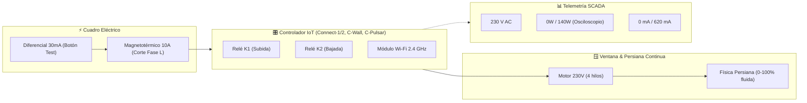
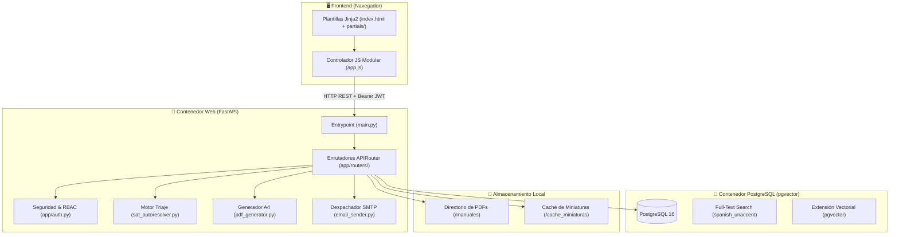
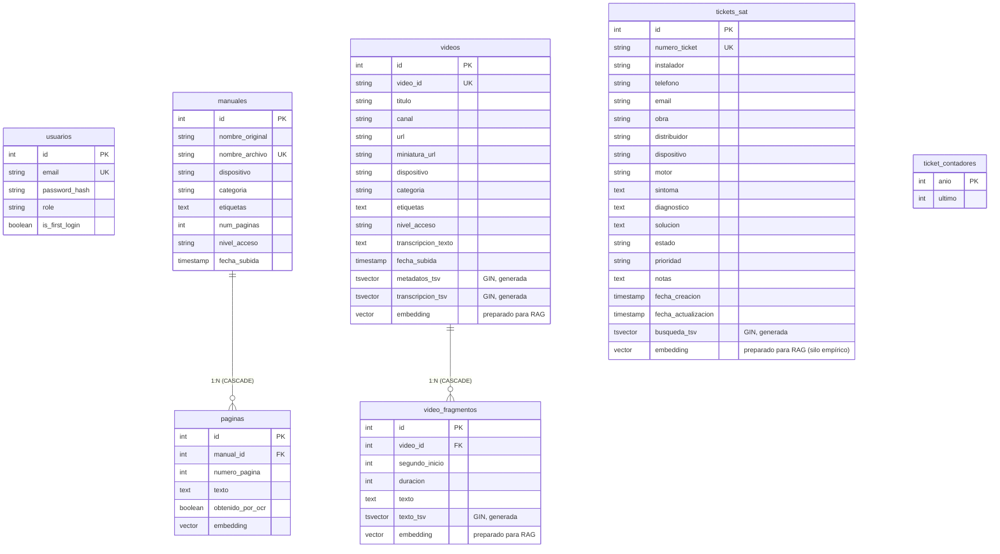

# 📚 Documentación Técnica Integral: Buscador de Manuales IoT & Videos

> **Versión del Sistema:** 3.0 (Arquitectura Modular Routers + Jinja2 Partials + Laboratorio Integral SCADA 230V + Persiana Continua + Hardening DAST)  
> **Fecha de Actualización:** 2026-09-09  
> **Arquitectura:** Cliente-Servidor Desacoplado y Modular (FastAPI APIRouter + Jinja2 Partials + PostgreSQL pgvector + Vanilla JS)  
> **Entorno:** Dockerizado con orquestación mediante Docker Compose  

---

## 📑 Tabla de Contenidos
1. [Resumen Ejecutivo y Propósito](#1-resumen-ejecutivo-y-propósito)
2. [Funcionalidades Principales](#2-funcionalidades-principales)
3. [Módulo de Asistencia SAT & Motor de Autoresolución](#3-módulo-de-asistencia-sat--motor-de-autoresolución)
4. [Esquemas Eléctricos 230V & Simulador Interactivo](#4-esquemas-eléctricos-230v--simulador-interactivo)
5. [Laboratorio Integral IoT & Banco de Pruebas SCADA 230V](#5-laboratorio-integral-iot--banco-de-pruebas-scada-230v)
6. [Navegación Discreta & Experiencia de Usuario SAT](#6-navegación-discreta--experiencia-de-usuario-sat)
7. [Mini-CRM de Tickets SAT & Partes Oficiales en PDF](#7-mini-crm-de-tickets-sat--partes-oficiales-en-pdf)
8. [Integración de Video Tutoriales de YouTube](#8-integración-de-video-tutoriales-de-youtube)
9. [Arquitectura del Sistema & Flujo de Datos](#9-arquitectura-del-sistema--flujo-de-datos)
10. [Estructura y Organización Modular del Código](#10-estructura-y-organización-modular-del-código)
11. [Stack Tecnológico Detallado](#11-stack-tecnológico-detallado)
12. [Modelo de Base de Datos y Esquema Relacional](#12-modelo-de-base-de-datos-y-esquema-relacional)
13. [Seguridad, RBAC & Hardening DAST](#13-seguridad-rbac--hardening-dast)
14. [Motor de Búsqueda y Algoritmo de Indexación Híbrido](#14-motor-de-búsqueda-y-algoritmo-de-indexación-híbrido)
15. [Catálogo de Endpoints de la API REST](#15-catálogo-de-endpoints-de-la-api-rest)
16. [Guía de Despliegue, Testing y Administración](#16-guía-de-despliegue-testing-y-administración)

---

## 1. Resumen Ejecutivo y Propósito

El **Buscador de Manuales IoT** es una plataforma web empresarial diseñada para centralizar, indexar y consultar documentación técnica y comercial de dispositivos IoT (Internet of Things) de **IoT Fenster** y su ecosistema de partners (**MySmartWindow**, **VBH GreenTeQ**, **Procomsa ICON**, **Kömmerling Könect**, etc.).

Resuelve la necesidad crítica de que los equipos de **Soporte Técnico (SAT)**, **Ingeniería** e **Instaladores en Obra** puedan localizar soluciones a averías, interpretar esquemas eléctricos 230V, simular fallos de cableado, generar partes oficiales RMA en PDF y descargar documentación offline en milisegundos a partir de cientos de manuales en formato PDF y tutoriales de YouTube, garantizando un estricto control de acceso basado en roles (RBAC).

---

## 2. Funcionalidades Principales

### 🔍 2.1. Buscador Inteligente Ponderado con Tesauro SAT
- **Búsqueda en Lenguaje Natural (Español):** Descarta palabras vacías (*stopwords*) y realiza lematización morfológica (*stemming*) insensible a acentos (`spanish_unaccent`).
- **Tesauro Técnico de Sinónimos SAT (+500 términos):** Expande automáticamente síntomas de obra (ej: *"parpadea"*, *"giro al revés"*, *"atasco"*), marcas partner cruzadas (*Wave 1/2* -> *Connect-1/2*) y problemas de red (*CG-NAT*, *aislamiento de clientes*, *WMF*, *modo AP*).
- **Ranking de Relevancia Ponderada:** Coincidencias en Título, Dispositivo, Categoría y Tags con **Peso 'A'**, texto interno de PDFs con **Peso 'C'**.
- **Resaltado de Coincidencias (*Snippets*):** Extrae párrafos y resalta visualmente los términos con `<mark>`.

### 📄 2.2. Visor PDF Integrado en la App (In-App Deep Linking)
- **Consulta Inmediata sin Descargas:** Visor modal a pantalla completa sin recargar el navegador ni abandonar la sesión.
- **Deep-Linking a Página Exacta (`#page=N&zoom=page-width`):** Salta automáticamente a la página donde se localizó la coincidencia técnica.
- **Cabeceras Seguras de Embebido:** Servidas con `X-Frame-Options: SAMEORIGIN` y `Content-Security-Policy: frame-ancestors 'self'`.

### 📦 2.3. Generador y Descarga de "Packs de Obra" (ZIP Offline)
- **Documentación Portátil para Zonas sin Cobertura:** Compila al instante un archivo `.zip` con todos los manuales técnicos en PDF del modelo solicitado.
- **Guía de YouTube Incluida:** Archivo `GUIA_VIDEOTUTORIALES_YOUTUBE.txt` con enlaces directos y recomendaciones de descarga previa.
- **Filtrado RBAC:** Los comerciales reciben únicamente documentación pública, mientras que técnicos y administradores descargan el paquete técnico completo.

### 👥 2.4. Control de Acceso Basado en Roles (RBAC)
- **`admin`:** Acceso total, subida de manuales, reindexación, borrado, sincronización de YouTube y gestión de usuarios.
- **`tecnico`:** Acceso a documentación técnica confidencial, buscador, visor PDF, Asistencia SAT, Simulador 230V, Laboratorio Integral, Mini-CRM y generación de partes RMA en PDF.
- **`comercial`:** Acceso restringido exclusivamente a documentación pública y catálogo comercial. Documentación técnica oculta con páginas amigables 403.

### 👁️ 2.5. Extracción Híbrida de Texto y OCR (Tesseract)
- **PDFs Digitales Nativos:** Extracción directa de texto mediante PyPDF a alta velocidad.
- **PDFs Escaneados o Fotocopias:** Detección automática de páginas sin capa de texto; `pypdfium2` renderiza el bitmap y `Tesseract OCR (spa)` extrae el texto en español.

---

## 3. Módulo de Asistencia SAT & Motor de Autoresolución

El módulo de **Asistencia SAT** (`app/routers/sat.py` y `app/sat_autoresolver.py`) asiste a los técnicos durante llamadas de soporte en obra mediante un árbol de diagnóstico de 4 bloques:

1. **🏷️ Bloque 1: Dispositivo, Marca & Contexto de Obra:** Identificación del partner (`IoT Fenster`, `VBH`, `Procomsa`, `Kömmerling`), modelo comercial y alcance en instalación.
2. **⚙️ Bloque 2: Comportamiento Técnico & Matriz de Inferencia:** Comparativa entre mando físico y app móvil, y catálogo de 18 síntomas clave (giro invertido, atasco mecánico, relé con clic sin giro, descalibración).
3. **📶 Bloque 3: Red Wi-Fi, Router & Móvil:** Banda (2.4 GHz vs 5 GHz, Mesh), seguridad (WPA2/WPA3), operadora y sistema operativo (Android / iOS).
4. **⏱️ Bloque 4: Contexto Temporal & Acciones Ya Realizadas:** Checklist de descarte que tacha automáticamente los pasos ya probados por el instalador.

### Panel Lateral de Dictamen Pericial en Vivo
- **Barra de Certeza Animada (%):** Nivel de confianza probabilístico en tiempo real.
- **Causa Raíz Diagnosticada & Tags de Solución.**
- **Protocolo de Acción Numerado:** Tacha en vivo las comprobaciones ya realizadas.
- **Manual Oficial Recomendado:** Botón directo para abrir el PDF oficial en la página exacta del procedimiento.
- **Exportación Directa:** Descarga directa de Parte Oficial en PDF, copia con formato para WhatsApp (`wa.me`) y guardado inmediato en el Mini-CRM de Tickets SAT.

---

## 4. Esquemas Eléctricos 230V & Simulador Interactivo

Herramienta vectorial unifilar interactiva en SVG para explicar y verificar instalaciones eléctricas:
- **Bornera Unifilar Dinámica:** L (Fase), N (Neutro), PE (Tierra), relés internos K1/K2, cableado de motor mecánico de 4 hilos (Azul neutro, Marrón subida, Negro bajada) y bus de baja tensión 3.3V (C-Pulsar).
- **Animación de Maniobra & Swap de Giro:** Visualización de relés abiertos/cerrados, flujo de corriente y cruce de fases cuando el motor gira al revés.
- **Modo Pantalla Completa (`⛶ Ver en Grande` / `Escape`):** Vista ampliada con controles de maniobra en vivo integrados.
- **Catálogo de 10 Averías Frecuentes:** Soluciones paso a paso con botón "Probar en Simulador" y descarga en formato `.svg`.

---

## 5. Laboratorio Integral IoT & Banco de Pruebas SCADA 230V

El **Laboratorio Integral** (`vista-laboratorio`) unifica la simulación eléctrica, física y de telemetría IoT en un banco interactivo de nivel industrial:



### Características Técnicas del Laboratorio:
1. **Física de Persiana Continua (`requestAnimationFrame`):**
   - Movimiento suave en tiempo real (0% cerrada a 100% abierta), respetando finales de carrera, velocidad en %/segundo y renderizado dinámico de lamas.
2. **Cuadro Eléctrico Interactivo:**
   - Magnetotérmico con palanca abatible que corta físicamente la fase 230V.
   - Interruptor diferencial con pulsador de test y disparo reactivo.
3. **Inyector de 5 Averías Frecuentes de Obra:**
   - ⚡ **Fase Invertida (Swap Giro):** Cables marrón y negro cruzados en bornera.
   - 🔥 **Disparo Térmico:** Bloqueo del motor por sobrecalentamiento tras maniobras continuadas.
   - 📶 **Red Wi-Fi Incompatible (5 GHz):** Simula fallo de emparejamiento por SSID no dividido.
   - 🔌 **Bus C-Pulsar Cortado:** Desconexión del bus de baja tensión en marco.
   - ⚙️ **Bloqueo Mecánico:** Lama trabada o tornillo atascado en guía (consumo sin avance).
4. **Telemetría SCADA en Tiempo Real:**
   - Monitorización continua de Voltaje (V), Potencia activa (W) con gráfico osciloscópico y Corriente (mA).
5. **Botón de Retorno:** Acceso rápido para volver al Buscador Principal sin perder el estado de la sesión.

---

## 6. Navegación Discreta & Experiencia de Usuario SAT

Para mantener la cabecera limpia y enfocada en el trabajo diario de soporte (Búsqueda y Tickets), los bancos técnicos de simulación se gestionan mediante **acceso discreto**:
- **Menú Principal Simplificado:** Pestañas superiores limitadas a `Buscador`, `Asistencia SAT`, `Tickets SAT`, `Biblioteca`, `Indexar` y `Usuarios`.
- **Dock Técnico en el Footer (`container-acceso-tecnico-discreto`):** Botón discreto `⚡ Bancos Técnicos & Simulación` en el pie de página que despliega un popover hacia arriba con acceso directo a:
  - *Simulador de Cableado 230V*.
  - *Laboratorio Integral Ecosistema*.
- **Retorno Rápido:** Cada simulador incluye un botón corporativo `← Volver al Buscador` en la cabecera de la vista.

---

## 7. Mini-CRM de Tickets SAT & Partes Oficiales en PDF

Gestión del ciclo de vida de averías con persistencia relacional en PostgreSQL (`tickets_sat`):
- **Panel de KPIs en Vivo:** Métricas dinámicas de Total, En Espera, Resueltos y RMA.
- **Numeración Correlativa Anual:** Generador de identificador `SAT-YYYY-XXXX`.
- **Acciones Rápidas con un Clic:**
  - 📞 **Llamada Telefónica (`tel:`)**: Marcación inmediata al instalador.
  - 💬 **WhatsApp (`wa.me`)**: Apertura del chat con resumen preconfigurado.
- **Generador de Parte Oficial SAT / RMA en PDF (ReportLab A4):**
  - Formato A4 profesional con membrete corporativo, datos de cliente/obra, desglose pericial (síntoma, diagnóstico, solución) y casillas para firma física y digital.
- **Despacho SMTP Asíncrono (`app/email_sender.py`):** Envío opcional del informe PDF adjunto al instalador con modo simulado para desarrollo.

---

## 8. Integración de Video Tutoriales de YouTube

Conexión nativa con el canal oficial **[@MySmartWindow](https://www.youtube.com/@MySmartWindow)**:
- **oEmbed sin API Keys:** Extracción de título, autor y miniatura en alta resolución.
- **Transcripciones de Voz Inteligentes:** Extracción de subtítulos hablados (`youtube-transcript-api`) en español e indexación fragmentada por segundos (`video_fragmentos`).
- **Reproductor Flotante Integrado:** Modal que reproduce directamente en el segundo exacto de la explicación técnica (`&start=Xs&autoplay=1`).
- **Worker Cron Programado en Segundo Plano:** Tarea asíncrona no bloqueante que sincroniza novedades del canal cada 24 horas (`GET /api/videos/sync-status`).

---

## 9. Arquitectura del Sistema & Flujo de Datos



---

## 10. Estructura y Organización Modular del Código

```text
buscador-manuales/
├── app/
│   ├── auth.py                  # Seguridad JWT, hashing bcrypt, dependencias RBAC y rate limiting
│   ├── database.py              # Modelos SQLAlchemy, conexión PostgreSQL, índices GIN y consultas FTS
│   ├── email_sender.py          # Despachador SMTP asíncrono con sanitización HTML y adjuntos PDF
│   ├── main.py                  # Entrypoint limpio FastAPI: lifespan, middleware de seguridad y routers
│   ├── pdf_generator.py         # Generador vectorial de Partes Oficiales SAT y RMA en PDF A4 (ReportLab)
│   ├── sat_autoresolver.py      # Motor experto de triaje, inferencia mando vs app y reglas SAT
│   ├── sinonimos.py             # Expansor léxico con tesauro SAT (+500 términos técnicos)
│   ├── routers/                 # Enrutadores modulares (APIRouter)
│   │   ├── __init__.py
│   │   ├── auth.py              # Endpoints: /api/token, /api/me, /api/usuarios/me/password
│   │   ├── buscar.py            # Endpoints: /api/buscar, /api/filtros, /api/sugerencias
│   │   ├── manuales.py          # Endpoints: /api/subir, /api/manuales, streaming PDF, miniaturas, packs ZIP
│   │   ├── sat.py               # Endpoints: /api/sat/tickets, CRM, triage, autoresolver y partes PDF
│   │   ├── usuarios.py          # Endpoints: /api/usuarios (CRUD y roles de usuario)
│   │   └── videos.py            # Endpoints: /api/videos, sincronización YouTube y estado cron
│   ├── templates/
│   │   ├── index.html           # Orquestador semántico de vistas Jinja2 (~200 líneas)
│   │   ├── error.html           # Plantilla visual adaptativa para errores 401, 403 y 404
│   │   └── partials/            # Componentes parciales descompuestos
│   │       ├── footer.html      # Pie de página corporativo con acceso técnico discreto
│   │       ├── modals.html      # Modales: login, password, visor PDF, packs, videos y tickets SAT
│   │       ├── navbar.html      # Cabecera principal, logo, tema claro/oscuro y pestañas
│   │       ├── vista_asistencia.html # Asistente de triaje SAT en 4 bloques funcionales
│   │       ├── vista_biblioteca.html # Biblioteca con pestañas de manuales y videos
│   │       ├── vista_buscar.html     # Buscador unificado y tarjetas híbridas
│   │       ├── vista_esquemas.html   # Simulador eléctrico unifilar 230V y averías
│   │       ├── vista_laboratorio.html# Banco de pruebas integral SCADA + persiana continua
│   │       ├── vista_subir.html      # Formulario drag & drop de indexación
│   │       ├── vista_tickets.html    # Panel de KPIs y tabla reactiva de Tickets SAT
│   │       └── vista_usuarios.html   # Panel de administración de usuarios RBAC
│   └── static/
│       ├── app.js               # Controlador JS del cliente, telemetría SCADA, simulador y CRM
│       └── logo.png             # Logotipo corporativo IoT Fenster
├── cache_miniaturas/            # Caché local de previsualizaciones PNG
├── data/
│   ├── thesaurus_manuales.ths   # Tesauro técnico SAT con más de 500 términos y marcas partner
│   └── sat/                     # Excel de incidencias históricas y matriz problemas-soluciones (leídos por sat_autoresolver.py)
├── docs/                        # Capturas de pantalla y documentación gráfica
├── manuales/                    # Volumen persistente de almacenamiento de archivos PDF
├── tests/
│   ├── conftest.py              # Fixtures aisladas, clientes de prueba y mocks en memoria
│   ├── unit/
│   │   └── test_sinonimos.py    # Tests puros del motor de tesauro léxico SAT (sin red/BD)
│   └── api/                     # Tests con TestClient contra la app completa
│       ├── test_rbac.py         # Tests críticos de seguridad RBAC, Path Traversal y miniaturas
│       ├── test_security.py     # SQLi/SSRF/subida de archivos/cabeceras de seguridad
│       ├── test_sat_email.py    # Flujo SAT con envío de email
│       └── test_tickets_sat.py  # Tests del Mini-CRM de Tickets SAT y generación de PDF A4
├── tools/manual_checks/         # Scripts de verificación manual contra un servidor real (no pytest)
├── Dockerfile                   # Imagen Docker de producción hardened (non-root appuser)
├── docker-compose.yml           # Orquestación con PostgreSQL 16 + pgvector
├── requirements.txt             # Dependencias exactas fijadas
└── DOCUMENTACION_SISTEMA.md     # Documentación técnica maestra del sistema
```

---

## 11. Stack Tecnológico Detallado

| Componente | Tecnología | Versión | Justificación |
| :--- | :--- | :--- | :--- |
| **Backend Framework** | Python / FastAPI | 0.111+ | Servidor ASGI de alto rendimiento con enrutadores desacoplados (`APIRouter`). |
| **Base de Datos** | PostgreSQL + pgvector | 16 | Soporte nativo de Full-Text Search lematizado en español y vectores de embeddings. |
| **ORM Relacional** | SQLAlchemy | 2.0+ | Transacciones atómicas y modelos fuertemente tipados. |
| **Generador PDF** | ReportLab | 4.0+ | Creación de Partes Oficiales SAT y órdenes RMA vectoriales en tamaño A4 con firmas. |
| **Frontend UI** | HTML5 / Jinja2 Partials / Vanilla JS | ES6+ | SPA ligera dividida en parciales limpios, sin sobrecarga de node_modules. |
| **Estilos CSS** | Tailwind CSS | Utility-first | Diseño contemporáneo con Glassmorphism y selector de tema claro/oscuro. |
| **Extracción PDF** | PyPDF / pdfplumber | Última | Parsing estructurado de PDFs digitales nativos. |
| **OCR Fallback** | Tesseract OCR + pypdfium2 | 5.x (spa) | Renderizado de páginas como imagen y extracción de texto en escaneos. |
| **YouTube Scraper**| `youtube-transcript-api` + oEmbed | 1.2+ | Ingesta de subtítulos hablados de YouTube sin consumo de cuotas de Google API. |
| **Criptografía** | python-jose + bcrypt | Estándar | Firma de tokens JWT stateless y hashing seguro de contraseñas. |

---

## 12. Modelo de Base de Datos y Esquema Relacional



`ticket_contadores` genera `numero_ticket` (`SAT-{año}-{secuencia}`) mediante un `UPSERT` atómico (`ON CONFLICT`), evitando la condición de carrera del esquema anterior (leer el último número y sumar 1 en Python). Las columnas `numero_ticket`, `instalador`, `email`, `telefono`, `obra`, `dispositivo`, `distribuidor`, `sintoma` y `diagnostico` de `tickets_sat` tienen además índices trigram (`pg_trgm`) para acelerar el filtro `ILIKE` del listado de tickets.

---

## 13. Seguridad, RBAC & Hardening DAST

El sistema implementa defensas en profundidad auditadas mediante pruebas de penetración dinámicas (DAST):

1. **Cabeceras HTTP Globales de Seguridad:**
   - `X-Content-Type-Options: nosniff`: Evita que el navegador intente adivinar tipos MIME.
   - `X-Frame-Options: SAMEORIGIN`: Protege contra ataques de Clickjacking.
   - `Referrer-Policy: strict-origin-when-cross-origin`: Protege la privacidad de URLs referenciadas.
   - `X-XSS-Protection: 1; mode=block`: Bloqueo activo de inyecciones de scripts reflejadas.
   - Eliminación proactiva de la cabecera `Server` para prevenir fingerprinting.
2. **Defensa contra Path Traversal:** Normalización de nombres con `Path(nombre).name`, bloqueo de secuencias `..`, `/` y `\` y validación de confinamiento estricto en disco.
3. **Control de Acceso Fail-Closed:** Si un manual o miniatura no está debidamente registrado en base de datos, se deniega inmediatamente el acceso (HTTP 404/403).
4. **Protección contra Inyecciones HTML en Emails:** Sanitización estricta mediante `html.escape()` en [app/email_sender.py](file:///c:/Users/david.paredes/Documents/buscador-manuales/app/email_sender.py).
5. **Rate Limiting en Login:** Limitación a un máximo de 5 intentos fallidos cada 15 minutos por IP (con soporte de cabecera `X-Forwarded-For` para balanceadores).
6. **Ejecución Docker Non-Root:** El contenedor web se ejecuta bajo el usuario sin privilegios `appuser` (UID 1000).

---

## 14. Motor de Búsqueda y Algoritmo de Indexación Híbrido

### 1. Vector Ponderado para Manuales PDF
$$\text{Vector}_{\text{PDF}} = \text{setweight}\left(\text{Título, Dispositivo, Tags}, \text{'A'}\right) \;\|\; \text{setweight}\left(\text{Texto Página PDF}, \text{'C'}\right)$$

### 2. Vector Ponderado para Videos de YouTube
$$\text{Vector}_{\text{Video}} = \text{setweight}\left(\text{Título + Tags}, \text{'A'}\right) \;\|\; \text{setweight}\left(\text{Subtítulo / Voz en Segundo Exacto}, \text{'C'}\right)$$

### 3. Rendimiento con Índices GIN y Columnas STORED
Las columnas `texto_tsv`/`metadatos_tsv` (en `paginas`/`manuales`), `metadatos_tsv`/`transcripcion_tsv` (en `videos`), `texto_tsv` (en `video_fragmentos`) y `busqueda_tsv` (en `tickets_sat`) están precalculadas como `GENERATED ALWAYS ... STORED` y respaldadas por índices GIN en PostgreSQL, permitiendo consultas instantáneas en milisegundos sin coste de CPU en tiempo de búsqueda. Las búsquedas de manuales y vídeos usan además `DISTINCT ON` + `LIMIT` en SQL (en vez de traer todos los resultados y recortar en Python) para escalar con catálogos grandes.

---

## 15. Catálogo de Endpoints de la API REST

### 🔐 Autenticación y Sesión (`app/routers/auth.py`)
- `POST /api/token`: Inicio de sesión OAuth2. Devuelve JWT Bearer, rol y email.
- `GET /api/me`: Perfil del usuario en sesión actual.
- `PUT /api/usuarios/me/password`: Cambio de contraseña propia.

### 🔍 Búsqueda y Filtros (`app/routers/buscar.py`)
- `GET /api/buscar?q={texto}&dispositivo={disp}&categoria={cat}&orden={orden}`: Búsqueda unificada en PDFs y videos.
- `GET /api/filtros`: Catálogo de dispositivos, categorías y etiquetas activas.
- `GET /api/sugerencias`: Autocompletado filtrado según nivel de acceso del usuario.

### 📄 Manuales PDF y Packs de Obra (`app/routers/manuales.py`)
- `POST /api/subir`: Subida múltiple e indexación con OCR (Solo Admin).
- `POST /api/reindexar`: Reindexación masiva de todos los documentos (Solo Admin).
- `GET /api/manuales`: Listado de biblioteca filtrado por RBAC.
- `PUT /api/manuales/{id}` y `DELETE /api/manuales/{id}`: Modificación y borrado (Solo Admin).
- `GET /manuales/{nombre_archivo}?token={jwt}`: Streaming seguro de PDF para visualización in-app.
- `GET /api/miniatura/{manual_id}/{numero_pagina}?token={jwt}`: Miniatura de página en PNG.
- `GET /api/dispositivos`: Catálogo de dispositivos con recuento de manuales y videos.
- `GET /api/dispositivos/{dispositivo}/pack`: Descarga de Pack de Obra ZIP offline.

### 🎥 Videos y Sincronizador (`app/routers/videos.py`)
- `GET /api/videos/sync-status`: Estado de telemetría del worker cron (Solo Admin).
- `POST /api/videos/sincronizar`: Sincronización bajo demanda del canal `@MySmartWindow` (Solo Admin).
- `POST /api/videos`: Alta de video individual mediante URL de YouTube (Solo Admin).
- `GET /api/videos`: Catálogo de videos según rol.
- `PUT /api/videos/{id}` y `DELETE /api/videos/{id}`: Edición y borrado (Solo Admin).

### 🩺 Asistencia SAT & Mini-CRM (`app/routers/sat.py`)
- `POST /api/sat/asistencia-triage`: Evaluación en vivo del cuestionario de 4 bloques técnicos, con % de coincidencia calculado (no fijo) y referencia al manual (página exacta) y vídeo (segundo exacto) más relevantes.
- `GET /api/sat/tickets?q={texto}&estado={estado}`: Listado de incidencias registradas.
- `GET /api/sat/tickets/stats`: Panel de métricas KPI globales del servicio técnico.
- `GET /api/sat/tickets/{id}`: Detalle completo de una incidencia.
- `POST /api/sat/tickets`: Creación manual de un ticket SAT.
- `POST /api/sat/tickets/auto-registrar-enviar`: Flujo unificado: guarda ticket, genera PDF y remite por email.
- `POST /api/sat/tickets/{id}/enviar-email`: Re-envío del parte oficial por correo SMTP.
- `PUT /api/sat/tickets/{id}` y `DELETE /api/sat/tickets/{id}`: Actualización y borrado de tickets.
- `GET /api/sat/tickets/{id}/pdf`: Descarga en streaming del Parte Oficial SAT / RMA en PDF A4 vectorial.

### 👥 Administración de Usuarios (`app/routers/usuarios.py`)
- `GET /api/usuarios`: Listado de usuarios registrados (Solo Admin).
- `POST /api/usuarios`: Alta de nuevo usuario (Solo Admin).
- `DELETE /api/usuarios/{id}`: Eliminación de usuario (Solo Admin).
- `PUT /api/usuarios/{id}/rol`: Modificación de rol RBAC (Solo Admin).

---

## 16. Guía de Despliegue, Testing y Administración

### Comandos de Operación con Docker:
```powershell
# 1. Iniciar servicios en segundo plano
docker compose up -d

# 2. Reiniciar contenedor web aplicando cambios de código
docker compose restart web

# 3. Ver logs en tiempo real
docker logs -f buscador_web

# 4. Reconstruir imágenes si se modifican dependencias
docker compose up -d --build
```

### Ejecución de la Suite de Tests Automatizados:
```powershell
# Ejecutar la suite de regresión y seguridad (tests/unit + tests/api) en el contenedor
docker exec buscador_web pytest -v
```
Los scripts en `tools/manual_checks/` no son parte de esta suite (requieren un servidor real ya arrancado) y se ejecutan aparte, a mano.

### Credenciales por Defecto del Sistema:
- **URL:** `http://localhost:8000`
- **Administrador:** `admin@empresa.com` / `admin123`
- **Técnico (Demo):** `tecnico@empresa.com` / `tecnico123`
- **Comercial (Demo):** `comercial@empresa.com` / `comercial123`

---
*Fin de la Documentación Técnica v3.0.*
