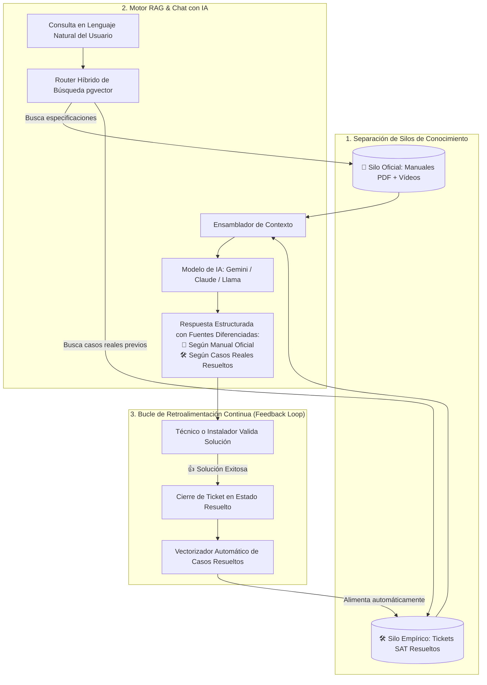
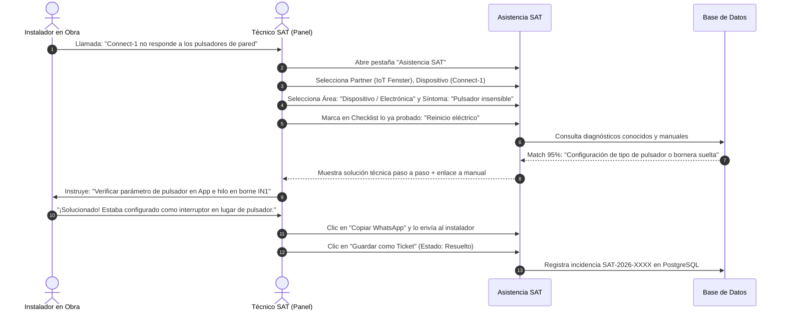

# Dossier Técnico y Operativo: Buscador de Manuales & Sistema SAT
**Plataforma IoT Fenster / MySmartWindow**  
*Fecha de actualización: Septiembre 2026*  
*Destinatario: Dirección Técnica y Equipo de Soporte*

---

## 1. Estado Actual del Panel

El sistema se encuentra actualmente **100% operativo, estabilizado y en fase de producción/desarrollo avanzado** desplegado mediante contenedores Docker (`buscador_web` con FastAPI y `buscador_db` con PostgreSQL 16 + pgvector).

### Módulos Implementados y Activos:

1. **Buscador Híbrido Inteligente (Manuales + Vídeos):**
   * Motor de búsqueda unificado que rastrea simultáneamente en **28 manuales técnicos en PDF** y **30 vídeos de formación técnica de YouTube** (con transcripción y subtítulos sincronizados por segundo).
   * Motor de búsqueda ponderado con **PostgreSQL Full-Text Search en español** (`to_tsvector` y `to_tsquery`) y normalización lingüística insensible a mayúsculas, tildes y diacríticos.
   * Diccionario de sinónimos técnicos del sector (ej. asocia automáticamente *"persiana al revés"* con *"inversión de fases / conexionado marrón-negro"* o *"cgnat"* con *"aislamiento de clientes / router"*).
   * Visualizador modal integrado de PDFs con salto a página exacta y visor embebido de YouTube con arranque en el minuto/segundo exacto de la explicación técnica.

2. **Asistente Técnico Guiado SAT (Diagnóstico Inteligente):**
   * Formulario inteligente estructurado en **12 bloques de decisión técnica** (Partner/Marca, Dispositivo, Modelo, Área de incidencia, Síntoma, Instalador, Obra, Red, Checklist de descarte de acciones ya probadas, etc.).
   * Motor de inferencia en tiempo real que calcula un **porcentaje de coincidencia (% match)** frente a la base de datos de averías conocidas de IoT Fenster, Somfy, VBH y Procomsa.
   * Generación instantánea de:
     * Dictamen técnico explicativo.
     * Protocolo de resolución en pasos claros y directos.
     * Botón de **"Copiar para WhatsApp"** con formato pre-redactado para enviar al instalador al instante.
     * Botón de **"Descargar PDF"** oficial con el dictamen de SAT.
     * Botón **"Guardar como Ticket"** que abre una incidencia formal sin reescribir nada.

3. **Gestor de Tickets SAT:**
   * Listado paginado con numeración automática (`SAT-2026-XXXX`).
   * Estados de seguimiento: `abierto`, `en_proceso`, `en_espera`, `resuelto` y `cerrado`.
   * Filtros rápidos por estado, búsqueda de tickets por instalador/obra/dispositivo y contador dinámico con badge de alertas en el menú superior.
   * Modal de detalle técnico con historial de intervenciones y adición de comentarios de seguimiento.
   * Exportación completa a hoja de cálculo **Excel / CSV** con un solo clic.

4. **Laboratorio Virtual y Simulador Eléctrico 230V:**
   * Banco de pruebas interactivo que simula el conexionado del motor de persiana a 230V, salidas de maniobra (subir/bajar), disparos de protección del cuadro (magnetotérmico y diferencial) y botón de inversión de fase.
   * Útil para formación interna de técnicos y verificación de averías antes de dar instrucciones en obra.

5. **Gestión Documental y Biblioteca:**
   * Panel de biblioteca con listado de documentos, número de páginas, roles asignados y eliminación controlada.

6. **Seguridad y Control de Acceso (RBAC):**
   * Autenticación basada en **JWT (JSON Web Tokens)** con expiración y hash de contraseñas mediante **Bcrypt**.
   * 4 roles de usuario diferenciados:
     * `admin`: Acceso total, subida/borrado de manuales, gestión de usuarios, SAT y tickets.
     * `tecnico`: Acceso a manuales técnicos, esquemas, simulador, Asistencia SAT y tickets.
     * `comercial`: Acceso limitado únicamente a manuales y fichas de nivel público.
     * `invitado`: Modo restringido para clientes o instaladores externos sin privilegios de edición.
   * Cambio de contraseña obligatorio en el primer inicio de sesión.
   * Persistencia de sesiones estabilizada ante reinicios del servidor.

7. **Arquitectura e Infraestructura:**
   * Pool de conexiones PostgreSQL de alta concurrencia con reconexión automática (`pool_pre_ping=True`, 20 conexiones base + 20 de desbordamiento, reciclado cada 5 min).
   * Interfaz reactiva moderna con diseño *Dark / Light mode*, *Glassmorphism*, prevención de cursores fantasma y efecto dinámico de iluminación (*spotlight*) en el fondo de puntos.

---

## 2. Próximos Pasos Recomendados

Para evolucionar el panel hacia un ecosistema de soporte técnico inteligente y autogestionado, los siguientes pasos estratégicos son prioritarios:

1. **Copiloto Conversacional con IA (Chat SAT Interactivo):**
   * Incorporar una ventana de **Chat interactivo con IA** en el panel donde el técnico o instalador pueda describir la incidencia en lenguaje natural (ej. *"Tengo un Connect-1 y al intentar vincularlo el led parpadea dos veces en azul y luego se apaga, ¿qué hago?"*).
   * El modelo razona sobre la incidencia, realiza repreguntas de descarte si faltan datos y redacta la solución técnica estructurada citando la fuente exacta.

2. **Separación Estructurada de Fuentes de Conocimiento (Silos Documentales):**
   * Segmentar la base de datos de conocimiento en **dos colecciones vectoriales diferenciadas**:
     * **Capa Teórica / Oficial:** Manuales PDF, especificaciones de fábrica, esquemas de conexionado y transcripciones de vídeos oficiales (conocimiento normativo).
     * **Capa Práctica / Empírica (Casos Reales):** Problemas reales diagnosticados y resueltos en obra por los técnicos del SAT (conocimiento empírico acumulado).
   * De este modo, la IA distingue entre *"lo que dice el manual teórico"* y *"lo que ha funcionado en obras reales"* (ej. particularidades de routers de operadoras como Digi o Movistar).

3. **Motor de Retroalimentación Continua (Continuous Learning Loop):**
   * **Auto-ingesta de tickets resueltos:** Cada vez que un ticket SAT se marca como `resuelto`, el sistema extrae automáticamente la tupla `(Síntoma + Condiciones de Obra) -> (Diagnóstico confirmado) -> (Solución técnica aplicada)` y la vectoriza en la base de datos de casos reales.
   * **Refuerzo por feedback:** Botones de *"Solución útil 👍 / No resolvió el problema 👎"* dentro del chat para que la IA priorice las soluciones con mayor tasa de éxito en campo.
   * **Evolución sin reentrenamiento:** El sistema aprende y se vuelve más sabio cada día sin necesidad de costosos reentrenamientos de modelos, gracias a la ingesta vectorial dinámica en `pgvector`.

4. **Notificaciones Automáticas por Correo (Integración SMTP / Transaccional):**
   * Configurar el envío automático de un email al instalador cuando se genera o resuelve un ticket SAT con el informe PDF adjunto.
   * Envío de aviso al equipo de soporte cuando un ticket lleva más de 48 horas en estado `en_espera`.

5. **PWA (Progressive Web App) y Modo Offline:**
   * Permitir que los instaladores descarguen la herramienta en su teléfono móvil con esquemas eléctricos clave guardados en caché local para zonas sin cobertura 4G.

6. **Conexión con Plataforma Cloud IoT (Telemetría de Dispositivos):**
   * Permitir consultar en vivo el estado MQTT del dispositivo en el broker cloud mediante su número de serie o MAC (estado online/offline, versión de firmware OTA y nivel de señal Wi-Fi).

---

## 3. Cómo se Añade Documentación Nueva y Cómo se Indexa

El sistema ofrece **dos formas** de añadir nueva documentación:

### Vía A: A través de la Interfaz Web (Pestaña "Indexar")
*(Recomendada para el personal de soporte y administración)*

1. El usuario administrador accede a la pestaña **"Indexar"**.
2. **Arrastra y suelta (Drag & Drop)** o selecciona el archivo `.pdf` (admite archivos de hasta 50 MB).
3. Rellena los metadatos requeridos:
   * **Nombre descriptivo:** Título comercial legible (ej. *Manual de Instalación Connect-2 v3*).
   * **Dispositivo:** Desplegable (`Connect-1`, `Connect-2`, `C-Wall`, `C-Pulsar`, `WAlarm`, etc.).
   * **Categoría:** Desplegable (`Manual de Usuario`, `Ficha Técnica`, `Guía de Instalación`, `Solución de Problemas`, etc.).
   * **Nivel de Acceso (RBAC):** Define quién puede verlo (`publico`, `instalador`, `tecnico`).
   * **Etiquetas clave (Tags):** Palabras clave separadas por comas (ej. *wifi, emparejamiento, cgnat, pulsador, bornera, finales de carrera*).
4. Hace clic en **"Procesar e Indexar"**.

### Vía B: Sincronización Automática por Carpeta (`sync_manuales.py`)
*(Recomendada para cargas masivas o despliegues iniciales)*

* Se depositan los archivos PDF en el directorio del servidor `manuales/`.
* El script ejecuta un análisis inteligente del nombre del archivo por patrones regex para deducir automáticamente el dispositivo, la categoría, las etiquetas y el nivel de acceso sin intervención manual.

### ¿Cómo se indexan las palabras clave internamente?

1. **Extracción y limpieza de texto:**
   * La biblioteca `pypdf`/`pdfplumber` recorre el documento hoja por hoja.
   * Si una página no tiene texto vectorial (es un documento escaneado o foto), entra en acción el motor **Tesseract OCR** en español, reconociendo el texto a partir de la imagen rasterizada.
2. **Generación de vectores léxicos (`tsvector` de PostgreSQL):**
   * PostgreSQL toma el texto de cada página y le aplica el diccionario de configuración en español (`spanish`).
   * **Lematización (Stemming):** Reduce palabras a su raíz común (ej. *"vinculando"*, *"vinculación"* y *"vincularán"* se indexan bajo la misma raíz `vincul`).
   * **Filtro de palabras vacías (Stop Words):** Elimina artículos, preposiciones y conectores (*"de"*, *"para"*, *"el"*, *"los"*) para optimizar el índice.
   * **Ponderación de campos:** El título del manual y las etiquetas (*tags*) tienen peso **'A'** (máxima prioridad), el dispositivo y categoría tienen peso **'B'**, y el cuerpo del texto de las páginas tiene peso **'C'**.
3. **Persistencia en base de datos:**
   * Se almacena el registro del manual en la tabla `manuales`.
   * Se almacena cada página con su contenido íntegro y su `tsvector` en la tabla `paginas_manuales`.
   * A partir de ese milisegundo, la documentación es localizable inmediatamente en el buscador.

---

## 4. Librerías de Python Fundamentales Utilizadas

El backend está construido sobre Python 3.11 en Linux/Docker utilizando librerías seleccionadas por su robustez, velocidad y bajo consumo de recursos:

| Categoría | Librería | Función Principal en el Sistema |
| :--- | :--- | :--- |
| **Framework API** | `fastapi` | Creación de endpoints REST asíncronos de alto rendimiento con validación tipada automática. |
| **Servidor ASGI** | `uvicorn` | Servidor web HTTP/ASGI de nivel de producción. |
| **Base de Datos** | `sqlalchemy` (v2.0) | ORM para consultas a PostgreSQL, transacciones y gestión del pool de conexiones. |
| **Driver PostgreSQL** | `psycopg2-binary` | Conector nativo en lenguaje C para máxima velocidad con la base de datos. |
| **Vectores e IA** | `pgvector` | Soporte para almacenamiento y búsqueda de similitud de vectores en PostgreSQL. |
| **Lectura de PDFs** | `pypdf` y `pdfplumber` | Extracción precisa de texto, metadatos, tablas y estructura de páginas PDF. |
| **OCR Documental** | `pytesseract` | Reconocimiento óptico de caracteres para PDFs que contienen imágenes o escaneos sin texto digital. |
| **Miniaturas PDF** | `pypdfium2` y `Pillow` | Renderizado acelerado de páginas PDF como imágenes PNG para las miniaturas visuales. |
| **Integración YouTube**| `youtube-transcript-api` | Descarga de transcripciones completas y subtítulos de vídeos técnicos con minutaje exacto. |
| **Seguridad & JWT** | `python-jose` | Generación, firmado criptográfico (HS256) y validación de tokens de acceso JWT. |
| **Cifrado Claves** | `passlib[bcrypt]` | Hashing unidireccional seguro de contraseñas de los usuarios. |
| **Testing** | `pytest` | Suite de pruebas unitarias y de integración continua (37 tests automatizados). |

---

## 5. El Rol de la IA en la Solución

### ¿Qué juego tiene la IA actualmente en el proceso?

Actualmente, el sistema utiliza un enfoque de **Inteligencia Algorítmica Híbrida**:
1. **NLP Determinista y Semántico:** Expansión léxica con lematización, ponderación de relevancia y un tesauro de sinónimos técnicos especializados que traduce el lenguaje coloquial del cliente a diagnósticos técnicos de ingeniería.
2. **Base de Datos Vectorial Preparada (`pgvector`):** La infraestructura cuenta con la extensión `pgvector` instalada y habilitada en el contenedor PostgreSQL, lista para alojar vectores densos (*embeddings*) de cada párrafo de los manuales.

### ¿Dónde se referencia y cómo se invoca?

* En el backend, las funciones de búsqueda (`database.buscar`) combinan la puntuación de texto (`ts_rank_cd`) con el filtro de permisos por rol.
* Para incorporar un modelo de lenguaje generativo (LLM) que actúe como copiloto conversacional del técnico, la llamada se realiza mediante un módulo **RAG (Retrieval-Augmented Generation)**:
  1. El usuario introduce una consulta.
  2. El buscador recupera las 3 páginas o párrafos más relevantes de los manuales de la base de datos.
  3. Se invoca al modelo de IA pasándole esos fragmentos como contexto exclusivo para que redacte una respuesta precisa sin inventar datos (*alucinaciones*).

### ¿Debe estar alojada en un servidor propio con GPU? ¿Ayudaría?

| Enfoque | Pros | Contras | ¿Es recomendable aquí? |
| :--- | :--- | :--- | :--- |
| **IA en Servidor Propio (On-Premise con GPU)**<br>*(ej. Ollama / vLLM con Llama 3 o Mistral 7B)* | • 100% de privacidad de datos.<br>• Funciona sin conexión a internet.<br>• Sin coste por llamada o token. | • Requiere hardware caro (servidor con GPU dedicada de 16-24 GB VRAM, coste >2.500 €).<br>• Alto consumo eléctrico.<br>• Mantenimiento de drivers CUDA y actualizaciones. | **Solo si es obligatorio por compliance estricto o instalaciones aisladas sin internet.** |
| **IA vía API Cloud Segura**<br>*(ej. Google Gemini API, OpenAI o Claude API)* | • Sin inversión en hardware.<br>• Modelos de última generación mucho más inteligentes.<br>• Despliegue en 5 minutos.<br>• Coste ínfimo (menos de 2-5 €/mes para el volumen de un departamento SAT). | • Requiere conexión a internet.<br>• Pago por uso de tokens. | **ALTAMENTE RECOMENDADO.** Es la opción estándar en la industria para empresas tecnológicas. |

> **Veredicto:** La mejor solución técnica es **híbrida**:
> 1. Un modelo local ligero de *Embeddings* (como `sentence-transformers/all-MiniLM-L6-v2`) que corre en la CPU del servidor existente para la indexación y búsqueda vectorial.
> 2. Una llamada a la API de un LLM comercial (Gemini / Claude / OpenAI) para redactar el dictamen final solo cuando el técnico lo solicite.

---

### Arquitectura Detallada: Chat con IA, Silos de Conocimiento y Retroalimentación Continua

Para implementar con éxito la visión de un **Chat Copiloto Inteligente con Retroalimentación Activa**, la arquitectura se estructura en **tres capas desacopladas**:



#### 1. Separación de Archivos y Silos de Conocimiento:
* **Silo A: Documentación Normativa / Teórica:** Manuales PDF de fabricante, fichas técnicas y esquemas de I+D. Representa la verdad técnica inmutable de cómo deben funcionar los circuitos y conexiones.
* **Silo B: Base de Casos Reales Resueltos (Troubleshooting KB):** Problemas reales vividos en obra. Contiene particularidades que no aparecen en los manuales estándar (ej. *"En instalaciones con routers de fibra de Digi, el CG-NAT y el aislamiento de AP impiden el emparejamiento hasta desactivar el aislamiento de red local"*).

#### 2. Dinámica de Consulta en el Chat con IA:
* Cuando el usuario escribe: *"Un Connect-1 no enlaza con la app en una obra nueva y el router es Wi-Fi 6"*, el motor no solo busca en los manuales de Connect-1, sino que consulta los **tickets resueltos con síntomas y condiciones similares**.
* La IA formula su respuesta distinguiendo las fuentes:
  * **📘 Procedimiento Oficial:** Pasos de reseteo y modo emparejamiento según manual técnico (pág. 3).
  * **🛠️ Experiencia Previa en Obras:** Avisa que en routers Wi-Fi 6 suele ser necesario forzar temporalmente la banda de 2,4 GHz o desactivar *Band Steering*, tal como se resolvió en incidencias anteriores.

#### 3. El Bucle de Retroalimentación Activa (Continuous Learning):
* **Sin necesidad de reentrenar la IA:** Los modelos masivos no necesitan ser reentrenados (lo cual costaría miles de euros). El aprendizaje continuo se logra mediante **ingesta vectorial dinámica en tiempo de ejecución**.
* **Auto-ingesta de tickets:** Al marcar un ticket como `resuelto`, el sistema convierte automáticamente el ticket en una ficha estructurada de caso:
  ```json
  {
    "dispositivo": "Connect-1",
    "sintoma": "Fallo vinculación router Wi-Fi 6",
    "causa_raiz": "Band Steering activo / red 5 GHz predominante",
    "solucion_validada": "Separar SSID de 2.4 y 5 GHz o alejar el móvil 5 metros durante el emparejamiento",
    "obra": "Residencial Gran Vía",
    "votos_utilidad": 1
  }
  ```
* Se genera su *embedding* y se guarda en la colección `tickets_resueltos`. En la siguiente consulta similar, el Chat ya dispondrá de ese caso real para sugerirlo como primera opción.

---

## 6. Caso de Uso Práctico: Asistencia en una Llamada SAT

A continuación se detalla el flujo cronológico que sigue un miembro del equipo de soporte desde que entra la llamada hasta que se cierra la incidencia:



### Detalle de los pasos en pantalla:

1. **Inicio de la llamada (Minuto 0:00):**
   * El instalador llama desde la obra indicando: *"Tengo un Connect-1 instalado y la persiana sube al pulsar la tecla de bajar"*.
2. **Toma de datos en Asistencia SAT (Minuto 0:20):**
   * El técnico abre la pestaña **Asistencia SAT**.
   * Bloque 1: Selecciona Partner `IoT Fenster / MySmartWindow`.
   * Bloque 2: Selecciona Dispositivo `Connect-1`.
   * Bloque 3: Selecciona Área `Motor / Instalación`.
   * Bloque 4: Selecciona Síntoma `Inversión de fases / persiana invertida`.
   * Bloques 6 y 7: Rellena nombre del instalador y obra (*Residencial Gran Vía*).
   * Bloque 12: Marca en el checklist si ya reiniciaron el router o la app para no hacerle perder tiempo repitiendo pasos.
3. **Diagnóstico Automático (Minuto 0:45):**
   * En el panel lateral derecho aparece de inmediato:
     * **Diagnóstico Sugerido (95% coincidencia):** *Inversión de fases de maniobra en borneras de salida.*
     * **Protocolo de Resolución:**
       1. Desconectar el automático del cuadro.
       2. Intercambiar los cables marrón y negro en los bornes de subida/bajada del Connect-1.
       3. Alternativamente, activar la opción *"Invertir sentido de giro"* desde los ajustes del dispositivo en la App móvil.
     * **Referencia oficial:** Enlace directo con un clic a la página 2 del manual técnico oficial del motor.
4. **Cierre y Documentación (Minuto 1:30):**
   * El técnico le transmite la solución al instalador por teléfono.
   * Hace clic en **"Copiar WhatsApp"** para enviar el resumen directamente al móvil del instalador por si le quedan dudas.
   * Hace clic en **"Guardar como Ticket"**: se genera el ticket oficial con estado **"Resuelto"**, quedando constancia para futuras averías en la misma obra.

---

## 7. Caso de Uso Práctico: Indexación de Documentación Nueva

Flujo paso a paso para cuando llega un nuevo manual, ficha técnica o actualización de producto:

1. **Recepción del documento:**
   * El fabricante o departamento de I+D entrega un nuevo PDF: `Guia_Solucion_Problemas_Connect_Evo_2026.pdf`.
2. **Acceso al módulo:**
   * El usuario de soporte inicia sesión con su cuenta de administrador o técnico habilitado.
   * Hace clic en la pestaña **"Indexar"** del menú de navegación.
3. **Carga y parametrización del documento:**
   * Arrastra el archivo PDF sobre la zona delimitada de subida.
   * Introduce los campos:
     * **Nombre Legible:** *Guía de Resolución de Incidencias Connect Evo (2026)*.
     * **Dispositivo:** Selecciona `Connect Evo` en el desplegable.
     * **Categoría:** Selecciona `Solución de Problemas`.
     * **Nivel de Acceso:** Selecciona `tecnico` (para que los comerciales o invitados no accedan a detalles confidenciales de borneras).
     * **Etiquetas clave:** Escribe palabras técnicas frecuentes: *cgnat, modo candado, 230v, led parpadea, error vinculacion, timeout*.
4. **Procesamiento del sistema:**
   * Hace clic en el botón **"Procesar e Indexar"**.
   * Una barra de progreso muestra la extracción del documento:
     * El servidor lee las 18 páginas del PDF.
     * Extrae texto, aplica OCR si detecta diagramas esquemáticos con texto y genera los vectores léxicos.
   * El sistema muestra un mensaje de éxito: `Manual indexado correctamente con ID 29 (18 páginas procesadas)`.
5. **Verificación inmediata:**
   * El técnico va a la pestaña **"Buscador"**, escribe *"error vinculacion connect evo"* y comprueba que el nuevo manual aparece en primera posición con el extracto de texto resaltado en amarillo.

---

## 8. Necesidades de Infraestructura Cloud a Incorporar

Para dar el salto a un despliegue Cloud seguro, escalable y accesible desde cualquier ubicación sin depender de una máquina local en la oficina, se requieren los siguientes componentes:

### 1. Servidor de Aplicación (Compute / Container Runtime)
* **Opciones recomendadas:**
  * **PaaS / CaaS:** *AWS App Runner*, *Google Cloud Run* o *Azure Container Apps* (arrancan los contenedores Docker automáticamente, escalan según el tráfico y se pagan por segundo de uso).
  * **VPS dedicado:** Servidor Cloud en *Hetzner* o *DigitalOcean* (ej. 4 vCPU, 8 GB RAM) con Docker y Docker Compose para máxima sencillez y coste fijo reducido (~15-25 €/mes).

### 2. Base de Datos Gestionada (PostgreSQL + pgvector)
* Separar la base de datos del servidor web para garantizar que nunca se pierdan datos ante reinicios o despliegues.
* **Opciones recomendadas:**
  * *Supabase* o *Neon.tech* (PostgreSQL gestionado nativo con soporte oficial de `pgvector`, backups automáticos cada hora y réplicas).
  * *AWS RDS for PostgreSQL* o *Google Cloud SQL*.

### 3. Almacenamiento de Objetos en la Nube (Cloud Storage / S3)
* Actualmente los PDFs se guardan en el volumen local `/app/manuales`.
* En la nube, los PDFs y las miniaturas deben guardarse en un bucket seguro compatible con **Amazon S3** (*AWS S3*, *Cloudflare R2* o *Google Cloud Storage*):
  * Cero ocupación de disco en el servidor de la app.
  * Enlaces de descarga firmados y protegidos con caducidad temporal (seguridad documental).
  * Coste prácticamente nulo (céntimos de euro al mes).

### 4. Seguridad Perimetral, Dominio y SSL (HTTPS)
* **Cloudflare:** Actuar como proxy inverso, cortafuegos web (WAF) contra ataques DDoS, aceleración de caché estática y certificados SSL gratuitos automáticos.
* Dominio corporativo seguro (ej. `sat.iotfenster.com` o `manuales.mysmartwindow.es`).

### 5. Servicio Transaccional de Correo Electrónico
* Para que los tickets SAT envíen acuse de recibo y soluciones técnicas a los clientes e instaladores por email.
* **Servicios recomendados:** *Amazon SES*, *SendGrid*, *Postmark* o *Brevo*.

### 6. Copias de Seguridad Automatizadas y Monitorización
* **Backups diarios automáticos** de la base de datos de tickets y configuraciones guardados en una región geográfica distinta.
* **Monitorización de disponibilidad (Uptime):** Alertas automáticas por Telegram/Slack si el endpoint `/api/health` deja de responder.

---

*Documento generado para davidiotfenster-dev/buscador-manuales.*  
*Archivo fuente disponible en el repositorio: `dossier_tecnico_y_operativo.md`.*
