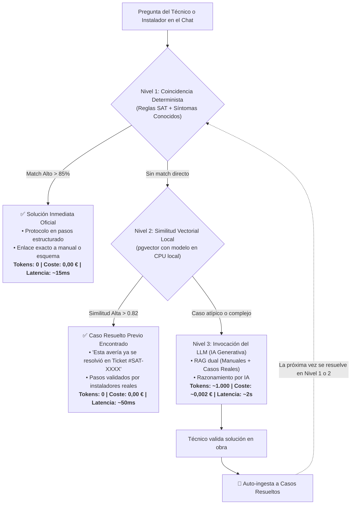
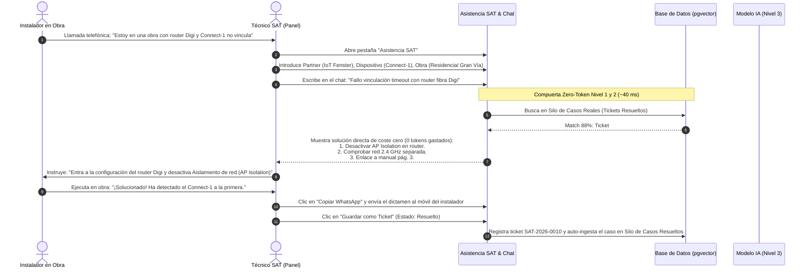

# NOTAS TÉCNICAS Y ESTRATÉGICAS: BUSCADOR DE MANUALES & ASISTENCIA SAT
**Plataforma IoT Fenster / MySmartWindow**  
*Documento de Referencia Técnica y Hoja de Ruta*  
*Fecha: Septiembre 2026 (revisado tras auditoría y limpieza de código)*

---

## 0. Estado Real vs. Roadmap (léase primero)

Este documento mezcla deliberadamente dos cosas: lo que **ya funciona hoy en el código** y una **hoja de ruta de IA** que todavía no tiene ni una línea implementada. Para evitar confusiones (un lector rápido de las secciones 5-8 podría creer que el Copiloto IA ya existe), esta tabla resume qué es qué:

| Bloque | Estado real |
| :--- | :--- |
| Buscador FTS en manuales/vídeos, tesauro de sinónimos, RBAC, Mini-CRM de tickets, generación de PDF/WhatsApp, Laboratorio 230V | ✅ **Implementado y funcionando** (seccs. 1-4, 6-7). |
| Índices GIN/trigram en vídeos y tickets, columnas `embedding` (pgvector) en `videos`/`video_fragmentos`/`tickets_sat`, contador atómico de `numero_ticket` | ✅ **Implementado** (preparación de esquema para el futuro RAG; ver sección 9 "Modelo de Base de Datos" en `DOCUMENTACION_SISTEMA.md`). |
| % de coincidencia técnica en el cuestionario de asistencia SAT calculado (no fijo por rama), vídeo de soporte enlazado al segundo exacto del fragmento de transcripción | ✅ **Implementado** en `app/sat_autoresolver.py`. Nota: en este entorno la tabla `video_fragmentos` está vacía (la sincronización de transcripciones de YouTube no está poblando datos), así que el enlace siempre cae en 00:00 hasta que se resuelva esa ingesta — el mecanismo en sí ya está conectado. |
| Copiloto Conversacional con IA, "Zero-Token Resolution Gate", generación de *embeddings* semánticos (locales o vía API), silos vectoriales realmente consultados por un LLM, caché/control de presupuesto de IA | ❌ **100% roadmap, sin código.** No existe `app/ai_copilot.py` ni ningún cliente LLM en `requirements.txt`. Secciones 5, 6 y parte de la 8 describen el diseño propuesto, no el sistema actual. |
| Object Storage (S3/R2), Postgres gestionado (Supabase/Neon), Cloudflare, email transaccional (SES/SendGrid) | ❌ **Roadmap.** Hoy: disco local, Postgres propio en Docker, sin WAF/CDN, SMTP genérico. Ver el checklist de la sección 8. |

---

## 1. Estado Actual del Panel

El sistema se encuentra en un estado **100% operativo y en producción local/desarrollo** orquestado mediante Docker Compose (`buscador_web` con FastAPI y `buscador_db` con PostgreSQL 16 + pgvector).

### Módulos Principales Activos:

1. **Buscador Híbrido Inteligente:**
   * Indexación y búsqueda simultánea en manuales PDF y vídeos de YouTube del canal oficial. El mecanismo de transcripción con minutaje (`video_fragmentos`) está implementado y conectado al buscador y al autoresolver SAT, pero en el entorno actual la ingesta de transcripciones de YouTube no está poblando datos — pendiente de diagnosticar (posible bloqueo/limitación de la API externa).
   * Motor de búsqueda ponderado con **PostgreSQL Full-Text Search** (`spanish`), lematización, normalización de acentos (resuelta hoy en Python vía el tesauro, no por la configuración `spanish_unaccent` de Postgres) y diccionario de sinónimos técnicos del sector (asocia términos coloquiales como *"persiana al revés"* con *"inversión de fases"*).
   * Visor modal de PDF con salto a página exacta y reproductor embebido de YouTube arrancando en el segundo exacto (cuando hay transcripción indexada).

2. **Asistencia Técnica Guiada SAT (Árbol de Decisión):**
   * Formulario inteligente en **12 bloques técnicos** (Partner/Marca, Dispositivo, Modelo, Área, Síntoma, Instalador, Obra, Red, Checklist de descarte de acciones ya probadas, etc.).
   * Motor en tiempo real con **% de coincidencia técnica** frente a la base de averías conocidas.
   * Generación instantánea de: dictamen técnico, protocolo en pasos, botón para **copiar a WhatsApp** formateado, botón de **descarga de PDF** oficial y botón **"Guardar como Ticket"** directo.

3. **Gestor de Tickets SAT:**
   * Listado paginado con numeración correlativa (`SAT-2026-XXXX`).
   * Estados: `abierto`, `en_proceso`, `en_espera`, `resuelto` y `cerrado`.
   * Filtros dinámicos, comentarios de seguimiento técnico, badge de notificaciones en tiempo real y **exportación a Excel / CSV** en un clic.

4. **Laboratorio Virtual y Simulador 230V:**
   * Banco de pruebas interactivo que simula cableado a motor, subida/bajada, inversión de fases y disparos de protecciones térmicas/diferenciales.

5. **Gestión Documental e Indexador:**
   * Subida drag & drop de PDFs de hasta 50 MB, extracción de texto con `pypdf`/`pdfplumber`, OCR con Tesseract para documentos escaneados y asignación de metadatos/etiquetas.

6. **Seguridad y Control de Acceso (RBAC):**
   * Autenticación JWT segura con Bcrypt. Roles: `admin`, `tecnico`, `comercial`, `invitado`. Clave `SECRET_KEY` persistente entre reinicios.

7. **Rendimiento UI y Conexiones:**
   * Pool de conexiones PostgreSQL resiliente (20 base + 20 overflow con `pool_pre_ping=True`).
   * Interfaz reactiva con soporte claro/oscuro, prevención de cursores fantasma y efecto de iluminación suave (*spotlight*) en el fondo de puntos al pasar el ratón.

---

## 2. Lista Completa de Próximos Pasos

Esta hoja de ruta incorpora tanto las integraciones de IA avanzada como la optimización de costes y expansión de infraestructura:

1. **Copiloto Conversacional con IA y Filosofía "Zero-Token First":**
   * Incorporar un **Chat interactivo con IA** en el panel para consultar averías en lenguaje natural.
   * **Compuerta de resolución de coste cero:** El sistema busca resolver la duda en Nivel 1 (reglas exactas) o Nivel 2 (casos resueltos en CPU local) **antes** de gastar un solo token en una API de IA.
   * El modelo solo se invoca en casos complejos o cuando el técnico lo solicita expresamente.

2. **Separación Estructurada de Fuentes de Conocimiento (Silos Documentales):**
   * Segmentar la base de conocimiento en dos colecciones vectoriales en `pgvector`:
     * **📘 Silo Teórico / Oficial:** Manuales PDF, especificaciones de fabricante, esquemas y vídeos de formación (la norma inmutable).
     * **🛠️ Silo Empírico / Casos Reales:** Problemas diagnosticados y validados en obras reales por el SAT (la experiencia de campo).
   * El Chat formulará sus respuestas diferenciando claramente: *"Según el manual oficial..."* vs. *"Según casos anteriores resueltos en obra..."*.

3. **Motor de Retroalimentación Continua y Ahorro Acumulativo (Feedback Loop):**
   * **Auto-ingesta de tickets:** Al marcar un ticket como `resuelto` (o validar una solución con 👍 en el chat), el sistema extrae automáticamente la tupla `(Síntoma + Obra) -> (Causa raíz) -> (Solución técnica)` y la vectoriza en la base de datos local.
   * **Ahorro deflacionario:** Cuando la IA resuelve una avería nueva por primera vez (gastando tokens una sola vez), queda guardada en la base local. La próxima vez que cualquier instalador pregunte lo mismo, se resolverá a **coste cero tokens**.
   * **Sin reentrenamientos:** Aprendizaje continuo instantáneo mediante ingesta vectorial dinámica en `pgvector`.

4. **Notificaciones Automáticas por Email (SMTP / Transaccional):**
   * Envío automático por correo del informe PDF al instalador al abrir o resolver su incidencia.
   * Alertas automáticas al equipo técnico si un ticket supera 48 horas sin actualizar.

5. **Búsqueda Vectorial Semántica Completa (RAG multilingüe):**
   * Integración de un modelo de *embeddings* local en CPU (ej. `all-MiniLM-L6-v2` o `bge-small-es`) para comprender preguntas en cualquier variante coloquial sin coste de API.

6. **App Móvil PWA y Modo Offline:**
   * Permitir instalar el panel como PWA en móviles y tablets de los instaladores, con almacenamiento local en caché de los manuales y esquemas más usados para trabajar en sótanos y zonas sin cobertura.

7. **Conexión con Plataforma Cloud IoT (Telemetría en Vivo):**
   * Consulta en tiempo real del broker MQTT introduciendo el número de serie o MAC del Connect-1/2: estado de conexión online/offline, versión de firmware OTA y calidad de señal Wi-Fi (RSSI).

8. **Dashboard de Analítica y Métricas SAT:**
   * Informes visuales de averías recurrentes por fabricante/partner, tiempos medios de resolución y modelos con mayor tasa de fallos en obra.

---

## 3. Cómo se Añade Documentación Nueva y Cómo se Indexa

El panel ofrece dos vías de entrada:

### A) Vía Panel Web (Pestaña "Indexar")
1. El usuario administrador arrastra el archivo `.pdf` (hasta 50 MB).
2. Selecciona los campos: Dispositivo, Categoría, Nivel de acceso (`publico`, `instalador`, `tecnico`) y Etiquetas (*tags*) clave.
3. Pulsa **"Procesar e Indexar"**.

### B) Vía Automática por Carpeta (`sync_manuales.py`)
* Se depositan los PDFs en la carpeta `manuales/` del servidor y el sincronizador deduce metadatos automáticamente por patrones de nombre de archivo.

### ¿Cómo se indexan las palabras clave internamente?
1. **Extracción y OCR:** `pypdf`/`pdfplumber` lee página a página. Si detecta imágenes o escaneos sin texto, aplica automáticamente **Tesseract OCR** en español.
2. **Lematización e Índice Léxico:** PostgreSQL genera el `tsvector` con el diccionario `spanish`, reduciendo palabras a su raíz común (*vinculando* -> *vincul*) y eliminando palabras vacías.
3. **Ponderación de Relevancia:** Título y etiquetas tienen peso **A** (máximo), dispositivo y categoría peso **B**, y texto del cuerpo peso **C**.
4. **Disponibilidad:** El manual queda listo para ser consultado en el buscador en milisegundos.

---

## 4. Librerías de Python Fundamentales Utilizadas

| Librería | Propósito en el Sistema |
| :--- | :--- |
| **fastapi** | Framework web moderno asíncrono para los endpoints de la API. |
| **uvicorn** | Servidor web ASGI de producción de alto rendimiento. |
| **sqlalchemy (2.0)** | ORM para gestión de modelos, transacciones y pool de conexiones resiliente. |
| **psycopg2-binary** | Driver nativo C para comunicación ultrarrápida con PostgreSQL. |
| **pgvector** | Extensión para almacenamiento y cálculo de similitud vectorial de embeddings. |
| **pypdf / pdfplumber** | Extracción estructural y lectura de texto en documentos PDF. |
| **pytesseract** | Motor de OCR para extraer texto de diagramas o PDFs escaneados. |
| **pypdfium2 / Pillow** | Renderizado acelerado de páginas como imágenes para generar miniaturas. |
| **youtube-transcript-api** | Descarga de transcripciones y subtítulos de vídeos de YouTube con minutaje exacto. |
| **python-jose** | Cifrado, firma y validación de tokens JWT (HS256). |
| **bcrypt** | Hash seguro de contraseñas de usuarios. |
| **pytest** | Suite de pruebas unitarias y de API automatizadas (`tests/unit` + `tests/api`). |

---

## 5. El Rol de la IA, Silos de Conocimiento y Arquitectura "Zero-Token First"

### ¿Qué juego real tiene la IA en este proceso?

La IA no se concibe como un "chatbot genérico" desconectado, sino como un **Orquestador Técnico RAG especializado** que actúa como copiloto del técnico, gobernado por una **Compuerta de Resolución en Cascada (*Zero-Token Resolution Gate*)**.

Su función técnica se divide en tres roles clave:
1. **Traductor e Intérprete Semántico:** Convierte la jerga coloquial del instalador en obra (*"el motor hace un claqueteo raro"*, *"la app dice que no encuentra el aparato"*, *"router de Digi no engancha"*) en términos técnicos normalizados de ingeniería (*desajuste de finales de carrera, microcortes en protocolo MQTT, aislamiento de clientes AP / CG-NAT*).
2. **Filtro de Coste Cero (Zero-Token Guard):** Analiza si la incidencia ya está resuelta en el árbol determinista o en los tickets históricos para entregar la respuesta **a coste 0 € y 0 tokens**.
3. **Razonador Deductivo (LLM RAG Nivel 3):** Solo cuando la incidencia es atípica, combina los manuales teóricos con los casos históricos para formular una hipótesis técnica fundada.

### ¿Dónde se referencia en el código?
* **Capa de Datos y Vectorial:** En `app/database.py`, con tablas estructuradas para `manuales`, `paginas_manuales`, `videos` y `tickets_sat`, junto a las extensiones de `pgvector` para distancias de coseno.
* **Capa Léxica y Tesauro:** En `app/sinonimos.py`, donde se normalizan los términos técnicos del sector de cerramientos y motores.
* **Capa de Búsqueda y Matching:** En `app/routers/buscar.py` y `app/routers/sat.py`, donde reside la lógica de cálculo de coincidencia técnica (% match).
* **Módulo de Copiloto IA (Planificado):** En `app/ai_copilot.py`, que encapsula el cliente asíncrono con el LLM, el selector de silos y la compuerta de ahorro de tokens.

### ¿Cómo se invoca en tiempo de ejecución?
1. **Vectorización de la consulta:** Se genera el *embedding* localmente en la CPU del servidor con un modelo compacto (ej. `all-MiniLM-L6-v2`) en menos de 20 ms sin coste alguno.
2. **Búsqueda en Silos Separados:**
   * **Silo A (Oficial / Teórico):** Busca en las páginas de manuales de fabricante y subtítulos de vídeos.
   * **Silo B (Empírico / Casos Reales):** Busca en los tickets SAT cerrados con `estado = 'resuelto'`.
3. **Comprobación de Umbral Zero-Token:** Si la similitud con un caso resuelto previo supera el 85%, se devuelve la solución **sin invocar al LLM** (0 tokens consumidos).
4. **Invocación LLM (Solo si no hay match suficiente o bajo demanda):** Se ensambla un *prompt* con los fragmentos de ambos silos como contexto estricto y se invoca la API (Gemini / Claude / OpenAI) vía HTTP asíncrono.



### ¿Servidor propio con GPU o API Cloud? ¿Ayudaría?

| Dimensión | Servidor Propio con GPU (On-Premise / Local) | API Cloud Segura (Gemini / Claude / OpenAI) |
| :--- | :--- | :--- |
| **Inversión Inicial** | Muy alta (>2.500 € - 4.000 € por GPU de 16-24 GB VRAM). | **0 € (Sin hardware que comprar ni amortizar).** |
| **Coste Operativo** | Alto consumo eléctrico continuo + SAI + climatización. | **Ínfimo (<2 € - 5 €/mes)** gracias a la compuerta Zero-Token. |
| **Mantenimiento** | Complejo: drivers CUDA, vLLM/Ollama, kernel Linux y caídas. | **Cero mantenimiento:** 99.99% de alta disponibilidad gestionada. |
| **Calidad de Respuestas**| Modelos abiertos de 7B-8B parámetros (inteligencia media). | **Modelos de frontera (Gemini 1.5 Pro, Claude 3.5, GPT-4o)** muy superiores en razonamiento técnico. |
| **Privacidad / Seguridad**| Los datos no salen del servidor físico. | Contratos DPA corporativos (no se usan datos para reentrenar). |

> **Conclusión técnica:** Un servidor propio con GPU **NO compensa**. La arquitectura ganadora es **híbrida**:
> 1. Un modelo local gratuito de *embeddings* en CPU (`all-MiniLM-L6-v2`) para que la búsqueda en los dos silos y el filtrado Zero-Token corran dentro del servidor a coste cero.
> 2. Una llamada a la API Cloud solo para el 15-20% de consultas complejas del Nivel 3.

---

## 6. Ejemplo Práctico: Soporte Técnico Completo de Principio a Fin

A continuación se detalla el flujo cronológico y operativo exacto que sigue un técnico del SAT atendiendo a un instalador en obra:



### Cronología minuto a minuto:
* **Minuto 0:00 - Recepción:** El instalador llama con prisas desde la vivienda: *"Tengo el Connect-1 alimentado, la persiana funciona con pulsador, pero la App se queda buscando y da timeout. El router es nuevo de Digi"*.
* **Minuto 0:25 - Entrada en el panel:** El técnico abre la pestaña **Asistencia SAT**, introduce los datos del instalador y escribe la incidencia.
* **Minuto 0:30 - Interceptación Zero-Token (Coste 0 € | 0 Tokens):** El Nivel 2 detecta que la semana pasada se cerró una incidencia idéntica en otra obra con Digi (`Ticket #SAT-2026-0008`). En la pantalla del técnico aparece la solución comprobada en obra sin haber consumido tokens de IA:
  * 📘 *Manual Oficial:* Red 2.4 GHz obligatoria y modo emparejamiento de 5 segundos.
  * 🛠️ *Experiencia de Campo:* Desactivar *"Aislamiento de clientes / AP Isolation"* en el router de fibra de Digi.
* **Minuto 1:10 - Prueba y validación en obra:** El instalador desactiva la opción en el router y el Connect-1 enlaza al instante.
* *(Ruta alternativa si hubiera sido una avería atípica):* Si los niveles 1 y 2 no hubiesen encontrado solución, el técnico habría pulsado *"🤖 Razonar caso atípico con IA"*. El LLM habría sintetizado los datos consumiendo unos 900 tokens (~0,002 €).
* **Minuto 1:40 - Cierre y retroalimentación activa:** El técnico pulsa **"Copiar WhatsApp"** para mandarle el resumen al instalador, pulsa **"Guardar como Ticket"** en estado `resuelto`, y el sistema vectoriza la solución en `pgvector`. **La próxima vez que surja este problema, se resolverá automáticamente a coste cero.**

---

## 7. Ejemplo Práctico: Indexación de Material Nuevo

Flujo detallado para cuando el departamento de I+D o el fabricante lanza una nueva versión de producto:

1. **Recepción del material:** Soporte recibe `Manual_Tecnico_Connect_Evo_v2.1_2026.pdf` (documento de 18 páginas con especificaciones de radiofrecuencia, borneras y esquemas de conexionado).
2. **Clasificación en Silos:** El técnico identifica que pertenece al **Silo A (Documentación Oficial / Teórica)**.
3. **Subida en el Panel:**
   * El usuario administrador va a la pestaña **"Indexar"**.
   * Arrastra el archivo PDF a la zona de carga.
4. **Parametrización de metadatos:**
   * **Nombre Legible:** *Manual Técnico y Maniobras Connect Evo v2.1*.
   * **Dispositivo:** Selecciona `Connect Evo` en el desplegable.
   * **Categoría:** `Manual de Instalación / Puesta en Marcha`.
   * **Nivel de Acceso:** `tecnico` (para proteger detalles de circuitos ante comerciales o invitados).
   * **Etiquetas clave (Tags):** Escribe términos técnicos prioritarios: *bluetooth 5.2, wifi 6, band steering, bornera, finales de carrera, 230v, led verde, timeout*.
5. **Procesamiento automático (Extracción + OCR + Indexación):**
   * Hace clic en **"Procesar e Indexar"**.
   * El backend procesa las 18 páginas en ~3 segundos:
     * Extrae texto digital de 16 páginas mediante `pdfplumber`.
     * En las 2 páginas con diagramas esquemáticos escaneados, activa **Tesseract OCR** en español para extraer el texto incrustado.
     * Genera el índice léxico ponderado `tsvector` en PostgreSQL.
     * Genera los vectores densos locales para `pgvector`.
   * Notificación en pantalla: `Manual ID 30 indexado con éxito (18 páginas procesadas)`.
6. **Disponibilidad inmediata:**
   * En ese mismo segundo, tanto el Buscador como el Chat con IA ya pueden responder preguntas sobre el Connect Evo v2.1 citando la página exacta del manual sin necesidad de reiniciar el servidor.

---

## 8. Necesidades de Infraestructura Cloud para Producción

Para garantizar un entorno Cloud robusto, seguro y de alta disponibilidad para toda la red de instaladores y técnicos:

```
  CLIENTES / INSTALADORES
             │
             ▼
  ┌────────────────────────────────────────────────────────┐
  │ 1. Cloudflare (WAF, SSL HTTPS, Anti-DDoS, CDN Assets)   │
  └────────────────────────────────────────────────────────┘
             │
             ▼
  ┌────────────────────────────────────────────────────────┐
  │ 2. Compute: AWS App Runner / Cloud Run / VPS Hetzner   │
  │    (Contenedores Docker: buscador_web con FastAPI)     │
  └────────────────────────────────────────────────────────┘
             │                                   │
             ▼                                   ▼
  ┌──────────────────────────────┐   ┌──────────────────────────────┐
  │ 3. Base de Datos Gestionada  │   │ 4. Object Storage (S3 / R2)  │
  │    (PostgreSQL 16 + pgvector)│   │    (Archivos PDF y miniaturas│
  │    • Silo A: manuales_docs   │   │     con URLs firmadas)       │
  │    • Silo B: tickets_resueltos│  └──────────────────────────────┘
  └──────────────────────────────┘
             │
             ▼
  ┌────────────────────────────────────────────────────────┐
  │ 5. Capa de IA Híbrida:                                 │
  │    • Embeddings en CPU local (Niveles 1 y 2: Coste 0 €)│
  │    • API Cloud Gemini / OpenAI (Nivel 3: Pago por uso) │
  └────────────────────────────────────────────────────────┘
             │
             ▼
  ┌────────────────────────────────────────────────────────┐
  │ 6. Email Transaccional (Amazon SES / SendGrid)         │
  │    (Envío de dictámenes PDF y justificantes de tickets)│
  └────────────────────────────────────────────────────────┘
```

### Checklist de migración (qué tocar exactamente en el código cuando se ejecute cada punto)

- [ ] **1. Servidor de Aplicación (Compute / Containers)**
  * *Opciones:* AWS App Runner, Google Cloud Run o VPS gestionado (Hetzner/DigitalOcean, 4 vCPU/8 GB) con el `docker-compose.yml` actual como base.
  * Sin cambios de código necesarios; el `Dockerfile` ya corre como usuario no-root y sin banner de servidor.

- [ ] **2. Base de Datos Gestionada (PostgreSQL 16 + `pgvector`, Supabase / Neon)**
  * `app/database.py::init_db()` ejecuta `CREATE EXTENSION` (`vector`, `unaccent`, `pg_trgm`) con el rol de la propia app — en Supabase/Neon gestionado puede requerir habilitar esas extensiones desde su panel con un rol con más privilegios en vez de que la app lo haga en caliente. Revisar antes de apuntar `DATABASE_URL` al proveedor gestionado.
  * Sin cambio de esquema: las tablas/columnas/índices ya están declarados de forma idempotente en `init_db()`.

- [ ] **3. Object Storage (AWS S3 / Cloudflare R2) con URLs firmadas**
  * Puntos de contacto a reescribir: subida (`app/routers/manuales.py::subir_manuales`, hoy `ruta_destino.write_bytes(...)` en disco), descarga/streaming (`app/routers/manuales.py`, `FileResponse` sobre `manuales/{nombre_archivo}`), caché de miniaturas (`cache_miniaturas/`, hoy PNG en disco), y el sincronizador (`sync_manuales.py`, que hoy escanea el directorio `manuales/` con `Path`).
  * `docker-compose.yml` monta `./manuales` como volumen — al migrar a S3/R2 ese volumen deja de ser necesario.
  * Generar URLs firmadas con caducidad (ej. 15 min) en vez de servir el PDF directamente vía la ruta autenticada actual.

- [ ] **4. Capa de IA (Copiloto RAG) — todavía no existe código, diseño en secciones 5-6**
  * Elegir proveedor de embeddings (local en CPU vs. API) y de LLM antes de escribir el primer `app/ai_copilot.py`.
  * Las columnas `embedding` (pgvector) ya están en `videos`, `video_fragmentos`, `tickets_sat` y `paginas` — falta el job que las pueble y el índice ANN (`ivfflat`/`hnsw`).
  * Diseñar desde el principio: caché semántica local + contador de coste mensual con corte de gasto — hoy no existe nada de esto en el código.

- [ ] **5. Seguridad Perimetral (Cloudflare: WAF, SSL, CDN, Anti-DDoS)**
  * La app hoy no tiene HTTPS ni WAF propios (responsabilidad 100% de esta capa externa); no requiere cambios de código, solo poner Cloudflare delante de uvicorn/App Runner.

- [ ] **6. Email Transaccional (Amazon SES / SendGrid / Brevo)**
  * `app/email_sender.py` usa `smtplib` genérico vía variables de entorno `SMTP_*` — cambiar el transporte a la API del proveedor es un cambio acotado a ese único módulo (misma construcción MIME, solo cambia cómo se envía).

- [ ] **7. Monitorización y Backups**
  * No existe hoy un endpoint `/api/health` dedicado (usar `GET /` como healthcheck mínimo, ya usado por el `HEALTHCHECK` del Dockerfile) ni alertas a Telegram/Slack — a implementar.
  * Backups: delegados al proveedor gestionado de Postgres (punto 2) en vez de gestionarlos a mano.

---

*Documento técnico único (fusiona el antiguo `notas.md`, eliminado por ser un duplicado exacto) guardado como `dossier_tecnico_y_operativo.md` en el repositorio davidiotfenster-dev/buscador-manuales.*
