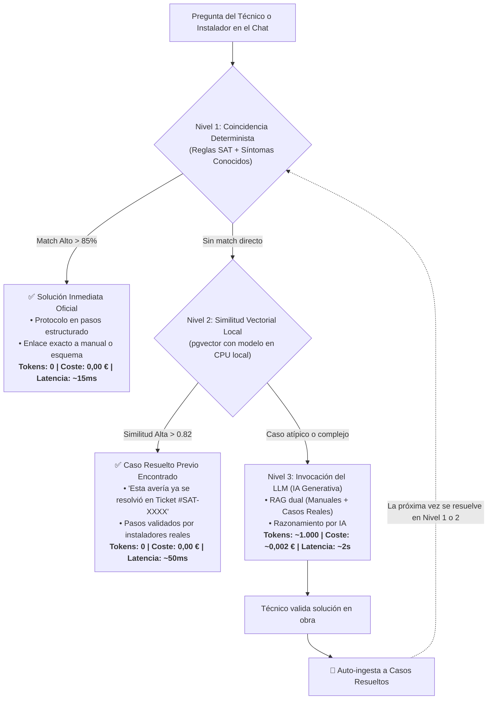
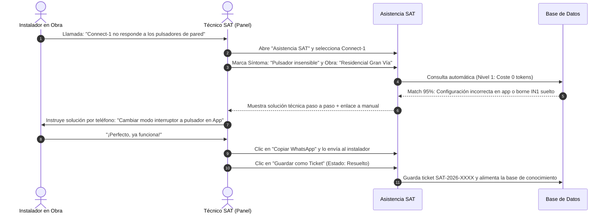

# NOTAS TÉCNICAS Y ESTRATÉGICAS: BUSCADOR DE MANUALES & ASISTENCIA SAT
**Plataforma IoT Fenster / MySmartWindow**  
*Documento de Referencia Técnica y Hoja de Ruta*  
*Fecha: Septiembre 2026*

---

## 1. Estado Actual del Panel

El sistema se encuentra en un estado **100% operativo y en producción local/desarrollo** orquestado mediante Docker Compose (`buscador_web` con FastAPI y `buscador_db` con PostgreSQL 16 + pgvector).

### Módulos Principales Activos:

1. **Buscador Híbrido Inteligente:**
   * Indexación y búsqueda simultánea en **28 manuales PDF** y **30 vídeos de YouTube** del canal oficial (con transcripción y subtítulos sincronizados por segundo).
   * Motor de búsqueda ponderado con **PostgreSQL Full-Text Search** (`spanish`), lematización, normalización de acentos y diccionario de sinónimos técnicos del sector (asocia términos coloquiales como *"persiana al revés"* con *"inversión de fases"*).
   * Visor modal de PDF con salto a página exacta y reproductor embebido de YouTube arrancando en el segundo exacto.

2. **Asistencia Técnica Guiada SAT (Árbol de Decisión):**
   * Formulario inteligente en **12 bloques técnicos** (Partner/Marca, Dispositivo, Modelo, Área, Síntoma, Instalador, Obra, Red, Checklist de descarte de acciones ya probadas, etc.).
   * Motor en tiempo real con **% de coincidencia técnica** frente a la base de averías conocidas.
   * Generación instantánea de: dictamen técnico, protocolo en pasos, botón para **copiar a WhatsApp** formateado, botón de **descarga de PDF** oficial y botón **"Guardar como Ticket"** directo.

3. **Gestor de Tickets SAT:**
   * Listado paginado con numeración correlativa (`SAT-2026-XXXX`).
   * Estados: `abierto`, `en_proceso`, `en_espera`, `resuelto` y `cerrado`.
   * Filtros dinámicos, comentarios de seguimiento técnico, badge de notificaciones en tiempo real y **exportación a Excel / CSV** en un clic.

4. **Laboratorio Virtual y Simulador 230V:**
   * Banco de pruebas interactivo que simula cableado a motor, subida/bajada, inversión de fases y disparos de protecciones térmicas/diferenciales.

5. **Gestión Documental e Indexador:**
   * Subida drag & drop de PDFs de hasta 50 MB, extracción de texto con `pypdf`/`pdfplumber`, OCR con Tesseract para documentos escaneados y asignación de metadatos/etiquetas.

6. **Seguridad y Control de Acceso (RBAC):**
   * Autenticación JWT segura con Bcrypt. Roles: `admin`, `tecnico`, `comercial`, `invitado`. Clave `SECRET_KEY` persistente entre reinicios.

7. **Rendimiento UI y Conexiones:**
   * Pool de conexiones PostgreSQL resiliente (20 base + 20 overflow con `pool_pre_ping=True`).
   * Interfaz reactiva con soporte claro/oscuro, prevención de cursores fantasma y efecto de iluminación suave (*spotlight*) en el fondo de puntos al pasar el ratón.

---

## 2. Lista Completa de Próximos Pasos

Esta hoja de ruta incorpora tanto las integraciones de IA avanzada como la optimización de costes y expansión de infraestructura:

1. **Copiloto Conversacional con IA y Filosofía "Zero-Token First":**
   * Incorporar un **Chat interactivo con IA** en el panel para consultar averías en lenguaje natural.
   * **Compuerta de resolución de coste cero:** El sistema busca resolver la duda en Nivel 1 (reglas exactas) o Nivel 2 (casos resueltos en CPU local) **antes** de gastar un solo token en una API de IA.
   * El modelo solo se invoca en casos complejos o cuando el técnico lo solicita expresamente.

2. **Separación Estructurada de Fuentes de Conocimiento (Silos Documentales):**
   * Segmentar la base de conocimiento en dos colecciones vectoriales en `pgvector`:
     * **📘 Silo Teórico / Oficial:** Manuales PDF, especificaciones de fabricante, esquemas y vídeos de formación (la norma inmutable).
     * **🛠️ Silo Empírico / Casos Reales:** Problemas diagnosticados y validados en obras reales por el SAT (la experiencia de campo).
   * El Chat formulará sus respuestas diferenciando claramente: *"Según el manual oficial..."* vs. *"Según casos anteriores resueltos en obra..."*.

3. **Motor de Retroalimentación Continua y Ahorro Acumulativo (Feedback Loop):**
   * **Auto-ingesta de tickets:** Al marcar un ticket como `resuelto` (o validar una solución con 👍 en el chat), el sistema extrae automáticamente la tupla `(Síntoma + Obra) -> (Causa raíz) -> (Solución técnica)` y la vectoriza en la base de datos local.
   * **Ahorro deflacionario:** Cuando la IA resuelve una avería nueva por primera vez (gastando tokens una sola vez), queda guardada en la base local. La próxima vez que cualquier instalador pregunte lo mismo, se resolverá a **coste cero tokens**.
   * **Sin reentrenamientos:** Aprendizaje continuo instantáneo mediante ingesta vectorial dinámica en `pgvector`.

4. **Notificaciones Automáticas por Email (SMTP / Transaccional):**
   * Envío automático por correo del informe PDF al instalador al abrir o resolver su incidencia.
   * Alertas automáticas al equipo técnico si un ticket supera 48 horas sin actualizar.

5. **Búsqueda Vectorial Semántica Completa (RAG multilingüe):**
   * Integración de un modelo de *embeddings* local en CPU (ej. `all-MiniLM-L6-v2` o `bge-small-es`) para comprender preguntas en cualquier variante coloquial sin coste de API.

6. **App Móvil PWA y Modo Offline:**
   * Permitir instalar el panel como PWA en móviles y tablets de los instaladores, con almacenamiento local en caché de los manuales y esquemas más usados para trabajar en sótanos y zonas sin cobertura.

7. **Conexión con Plataforma Cloud IoT (Telemetría en Vivo):**
   * Consulta en tiempo real del broker MQTT introduciendo el número de serie o MAC del Connect-1/2: estado de conexión online/offline, versión de firmware OTA y calidad de señal Wi-Fi (RSSI).

8. **Dashboard de Analítica y Métricas SAT:**
   * Informes visuales de averías recurrentes por fabricante/partner, tiempos medios de resolución y modelos con mayor tasa de fallos en obra.

---

## 3. Cómo se Añade Documentación Nueva y Cómo se Indexa

El panel ofrece dos vías de entrada:

### A) Vía Panel Web (Pestaña "Indexar")
1. El usuario administrador arrastra el archivo `.pdf` (hasta 50 MB).
2. Selecciona los campos: Dispositivo, Categoría, Nivel de acceso (`publico`, `instalador`, `tecnico`) y Etiquetas (*tags*) clave.
3. Pulsa **"Procesar e Indexar"**.

### B) Vía Automática por Carpeta (`sync_manuales.py`)
* Se depositan los PDFs en la carpeta `manuales/` del servidor y el sincronizador deduce metadatos automáticamente por patrones de nombre de archivo.

### ¿Cómo se indexan las palabras clave internamente?
1. **Extracción y OCR:** `pypdf`/`pdfplumber` lee página a página. Si detecta imágenes o escaneos sin texto, aplica automáticamente **Tesseract OCR** en español.
2. **Lematización e Índice Léxico:** PostgreSQL genera el `tsvector` con el diccionario `spanish`, reduciendo palabras a su raíz común (*vinculando* -> *vincul*) y eliminando palabras vacías.
3. **Ponderación de Relevancia:** Título y etiquetas tienen peso **A** (máximo), dispositivo y categoría peso **B**, y texto del cuerpo peso **C**.
4. **Disponibilidad:** El manual queda listo para ser consultado en el buscador en milisegundos.

---

## 4. Librerías de Python Fundamentales Utilizadas

| Librería | Propósito en el Sistema |
| :--- | :--- |
| **fastapi** | Framework web moderno asíncrono para los endpoints de la API. |
| **uvicorn** | Servidor web ASGI de producción de alto rendimiento. |
| **sqlalchemy (2.0)** | ORM para gestión de modelos, transacciones y pool de conexiones resiliente. |
| **psycopg2-binary** | Driver nativo C para comunicación ultrarrápida con PostgreSQL. |
| **pgvector** | Extensión para almacenamiento y cálculo de similitud vectorial de embeddings. |
| **pypdf / pdfplumber** | Extracción estructural y lectura de texto en documentos PDF. |
| **pytesseract** | Motor de OCR para extraer texto de diagramas o PDFs escaneados. |
| **pypdfium2 / Pillow** | Renderizado acelerado de páginas como imágenes para generar miniaturas. |
| **youtube-transcript-api** | Descarga de transcripciones y subtítulos de vídeos de YouTube con minutaje exacto. |
| **python-jose** | Cifrado, firma y validación de tokens JWT (HS256). |
| **passlib[bcrypt]** | Hash seguro de contraseñas de usuarios. |
| **pytest** | Suite de pruebas unitarias automatizadas (37 tests activos). |

---

## 5. El Rol de la IA y la Arquitectura "Zero-Token First"

### ¿Qué juego tiene la IA?
Actualmente combina **NLP determinista ponderado y tesauro de sinónimos técnicos** con la infraestructura `pgvector` preparada para búsqueda densa. La evolución hacia un Chat generativo se realiza mediante una **Arquitectura en Cascada de Coste Cero**:

### ¿Servidor propio con GPU o API Cloud?
* **Servidor propio (On-Premise con GPU):** Solo justificado si hay obligación legal de aislamiento total sin salida a internet. Requiere hardware caro (>2.500 € por GPU), alto consumo y mantenimiento de drivers.
* **API Cloud Segura (Gemini / Claude / OpenAI):** Muy superior en inteligencia, puesta en marcha inmediata y coste ínfimo (<2-5 €/mes para el volumen de un SAT).
* **Solución óptima Híbrida:** Modelo local gratuito de *embeddings* en CPU (`sentence-transformers`) para los Niveles 1 y 2 (coste cero) + API Cloud solo cuando se dispara el Nivel 3.

---

## 6. Ejemplo Práctico: Soporte Técnico en Llamada Real

* **Duración total:** Menos de 2 minutos.
* **Gasto de tokens:** Cero tokens (resuelto por coincidencia determinista).
* **Resultado:** Registro formal del ticket, instalador atendido y caso archivado para futuras consultas.

---

## 7. Ejemplo Práctico: Indexación de Material Nuevo

1. Soporte recibe `Guia_Solucion_Problemas_Connect_Evo_2026.pdf`.
2. Accede a **"Indexar"** y arrastra el archivo.
3. Rellena: Dispositivo `Connect Evo`, Categoría `Solución de Problemas`, Rol `tecnico` y etiquetas clave (`cgnat, vinculacion, led azul, 230v`).
4. Pulsa **"Procesar e Indexar"**: el servidor procesa las páginas en 3 segundos, extrae el texto, genera el índice léxico y confirma el alta.
5. Inmediatamente después, cualquier búsqueda de instaladores o técnicos incluirá esa guía en los primeros resultados.

---

## 8. Necesidades de Infraestructura Cloud para Producción

1. **Servidor de Aplicación (Compute):**
   * Despliegue en contenedor mediante *AWS App Runner*, *Google Cloud Run* o un VPS gestionado (*Hetzner / DigitalOcean* con Docker Compose).
2. **Base de Datos Gestionada:**
   * *Supabase* o *Neon.tech* (PostgreSQL gestionado con `pgvector` nativo, backups automáticos y alta disponibilidad).
3. **Almacenamiento de Archivos (Object Storage S3):**
   * *AWS S3* o *Cloudflare R2* para almacenar los PDFs y miniaturas fuera del disco efímero del servidor, con enlaces de descarga firmados y protegidos.
4. **Seguridad Perimetral y SSL (HTTPS):**
   * *Cloudflare* como proxy inverso (WAF, protección anti-DDoS, certificados SSL gratuitos) con dominio propio (ej. `sat.iotfenster.es`).
5. **Servicio de Email Transaccional:**
   * *Amazon SES*, *SendGrid* o *Brevo* para el envío de justificantes de tickets y dictámenes técnicos por correo a los instaladores.
6. **Copias de Seguridad y Monitorización:**
   * Backups diarios automatizados en región independiente y alertas de uptime si el endpoint `/api/health` reporta incidencias.

---

*Documento técnico guardado como `notas.md` en el repositorio davidiotfenster-dev/buscador-manuales.*
